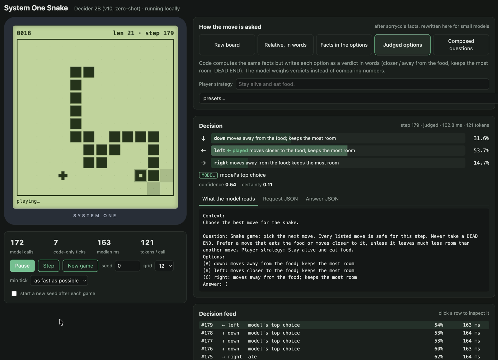

# Open-source Jev reproductions, tested zero-shot in three situations

[](docs/snake-report.md)

*Decider 2B, an open 2B System One model, playing Snake zero-shot in the local demo (`08_snake_server.py`): every
move is one typed question, answered with a probability per option.*

A hands-on tutorial. **Jev** (TypeSafe AI, released 15 Sept 2026) is a "System One" model: it answers typed
questions with probabilities instead of generating text. Within a week, dozens of open reproductions appeared. This
repo takes the best-ranked ones that run on a 32 GB Apple M5, plus the strongest ones released since, and tests them
**zero-shot, with no training for the task**, in three very different situations:

| | Tweet sentiment | Snake | Finnish |
|---|---|---|---|
| **The situation** | classify one text: negative / neutral / positive | a decision loop: one move per tick, hundreds per game | understand Finnish: topic, reading comprehension, intent, reviews |
| **The question** | the same `choice` question about 300 human-labelled tweets | one `choice` per move, asked six different ways | the same `choice` questions on 4 datasets × 300 items, in English and in Finnish |
| **Compared with** | local LLMs in LM Studio | code-only players (greedy, greedy + dead-end check) | Qwen 3.8 27B (vLLM, another machine) |
| **Headline** | Decider 4B v2 and 2B tie the best local LLM (75.0% / 74.0% vs 74.0%), 2.6–4.6× faster | asked to read the board, the models fail (so does Jev); with one verdict per option, Decider 2B eats 36.9 food per game, close to code's 41.1 | Decider 4B v2, Kev 9B and Kev 4B lose ~2 points from English to Finnish and are near the 27B LLM; Decider 2B loses ~7; CLM collapses |
| **Report** | [docs/sentiment-report.md](docs/sentiment-report.md) · [interactive](docs/page/index.html) | [docs/snake-report.md](docs/snake-report.md) · [interactive](docs/snake-report/index.html) | [docs/finnish-report.md](docs/finnish-report.md) · [interactive](docs/finnish-report/index.html) |

The reports are generated from `results/`: `uv run python docs/page/build.py`,
`uv run python docs/snake-report/build.py` and `uv run python docs/finnish-report/build.py`.

## The models

* **Reproductions:** [Laya](https://huggingface.co/convaiinnovations/laya) (+ multilingual),
  [Kev](https://github.com/jaredpalmer/kev) 0.8B / 4B / 9B, [SemIf](https://github.com/TheoLeeCJ/openjev),
  [openvons](https://github.com/genai-craft/openvons), [Decider 2B](https://huggingface.co/Mapika/decider-2b),
  [Decider 4B v2](https://huggingface.co/Mapika/decider-4b/tree/v2),
  [GLiNER2.5-Decide](https://huggingface.co/fastino/GLiNER2.5-Decide) (340M and 1B; for Finnish the multilingual
  [GLiNER2.5-multi-Decide](https://huggingface.co/fastino/GLiNER2.5-multi-Decide), 287M) and
  [CLM 8B](https://github.com/Contrastive-LM/CLM) (contrastive bi-encoder).
  Chosen from the [Jev Decision Index](https://huggingface.co/spaces/multimodalart/jev-decision-index), plus the
  last four, released after it; why the index's top five don't fit a 32 GB Mac: [docs/1-landscape.md](docs/1-landscape.md)
* **Which test ran which:** all of them ran the sentiment test; seven of them also played Snake: Decider 2B,
  Decider 4B v2, Kev 4B, CLM 8B, GLiNER2.5-Decide 340M and 1B, and Laya. Finnish: Decider 2B and 4B v2, Kev 0.8B / 4B /
  9B, GLiNER2.5-multi-Decide and CLM 8B.
* **LLM baselines (sentiment):** Gemma 4 26B-A4B, Gemma 4 12B and Qwen 3.8 27B in LM Studio, with JSON-schema output.
  **Finnish:** Qwen 3.8 27B (FP8) on a vLLM server, thinking off; that test compares accuracy, not speed

## Test 1: tweet sentiment

[TweetEval sentiment](https://huggingface.co/datasets/cardiffnlp/tweet_eval) (SemEval-2017 Task 4A): tweets labelled
negative / neutral / positive by human annotators, a class-balanced sample of 300 from the test split. Every engine
gets the same question dict. Report: [docs/sentiment-report.md](docs/sentiment-report.md).

### Results

300 balanced test tweets, one per call, nothing trained on tweets. ±5 points of sampling noise.

| System | Family | Index # | Accuracy | Macro-F1 | p50 | ECE |
|---|---|---|---|---|---|---|
| **Decider 4B v2** | full fine-tune, letter logits | new | **0.750** | **0.751** | 258 ms | 0.056 |
| **Decider 2B** | full fine-tune, letter logits | 13 | 0.740 | 0.745 | 143 ms | **0.032** |
| LLM Gemma 4 26B-A4B | LLM, class descriptions | – | **0.740** | 0.736 | 660 ms | 0.260 |
| SemIf · Qwen3.5-9B-Base *(variant)* | inference technique | – | 0.730 | 0.707 | 320 ms | 0.080 |
| LLM Gemma 4 26B-A4B | LLM, bare prompt | – | 0.723 | 0.715 | 388 ms | 0.277 |
| **SemIf** · Qwen3.5-4B-Base | inference technique | 11 | 0.717 | 0.698 | 189 ms | 0.054 |
| LLM Gemma 4 12B | LLM, class descriptions | – | 0.713 | 0.714 | 2.3 s | 0.287 |
| LLM Qwen 3.8 27B | LLM, bare prompt | – | 0.710 | 0.694 | 2.9 s | 0.290 |
| Kev 9B | LoRA + pointer | 6 | 0.690 | 0.695 | 448 ms | 0.052 |
| **openvons** · Qwen3-4B-Instruct | inference technique | 10 | 0.687 | 0.617 | 301 ms | 0.305 |
| LLM Qwen 3.8 27B | LLM, class descriptions | – | 0.663 | 0.656 | 3.3 s | 0.337 |
| Kev 4B | LoRA + pointer | 7 | 0.637 | 0.646 | 261 ms | 0.107 |
| **GLiNER2.5-Decide** (340M) | encoder + head | new | 0.637 | 0.635 | 62 ms | 0.061 |
| Laya | encoder + head | 30 | 0.633 | 0.639 | 49 ms | 0.071 |
| **GLiNER2.5-Decide-1B** | encoder + head | new | 0.630 | 0.632 | 73 ms | 0.081 |
| Laya multilingual | encoder + head | – | 0.630 | 0.634 | 20 ms | 0.112 |
| Kev 0.8B | LoRA + pointer | – | 0.587 | 0.597 | 45 ms | 0.128 |
| *Nearest description by embedding* | *bi-encoder baseline* | – | *0.567* | *0.537* | *13 ms* | *0.071* |
| **CLM 8B** | contrastive bi-encoder | new | 0.517 | 0.451 | 167 ms | 0.271 |
| *Qwen3-8B raw embeddings* | *bi-encoder baseline* | – | *0.343* | *0.193* | *166 ms* | *0.213* |

(Gemma 4 12B with the bare prompt: 0.697. Full table: [results/REPORT.md](results/REPORT.md). Index # "new" = released
after the Decision Index edition used here.)

* **The Decider models tie the best local LLM zero-shot**: Decider 4B v2 0.750 and Decider 2B 0.740 vs
  Gemma 26B 0.740 (paired p ≈ 0.8), with honest probabilities. The 2B is the better deal: as accurate, 4.6× faster
  than the LLM and 1.8× faster than the 4B.
* **Bigger isn't automatically better within a family**: GLiNER2.5-Decide-1B (0.630) doesn't beat the 340M
  model (0.637).
* **Letter-logit readouts lead**; even a stock base model read that way (SemIf) beats Kev's and
  Laya's trained heads here. On an *instruct* model (openvons) the same trick almost never says
  "neutral" and is over-confident.
* **Embeddings aren't enough, even trained ones**: nearest label description by cosine gets 0.567, and CLM's
  trained contrastive heads on Qwen3-8B get 0.517 (0.43–0.55 depending on how the options are worded).
* **Label descriptions are a model-specific lever**: no effect on Gemma, +4.7 points for Qwen 27B
  without them (paired test p = 0.013).
* **Option order**: rerunning 11 models with all 6 option orders ([results/position_bias.json](results/position_bias.json)):

  | Answers that flip with order alone | Models |
  |---|---|
  | 0% (options are embedded one by one) | CLM 8B |
  | 5.7%, no preferred position | Decider 2B (its training shuffles options) |
  | 10–13%, no preferred position | Decider 4B v2, GLiNER2.5-multi-Decide, Kev 0.8B / 4B / 9B |
  | 17–19%, no significant preferred position | GLiNER2.5-Decide-1B, SemIf |
  | 22–23%, **favours the first option** | Laya (0.69 accuracy when the answer is first vs 0.59 when last), GLiNER2.5-Decide 340M (0.72 vs 0.56) |

  GLiNER needed a fix first: gliner2's `Classifier` caches compiled schemas under a key that ignores label order, so a
  reordered label set silently reused the first order it saw; `adapters/gliner_systemone_server.py` now compiles
  each request itself.
* **Cascade**: accept Decider's answer at ≥ 0.5 confidence, else ask Gemma 26B → 0.753 with only 6% of tweets
  sent to the LLM.

#### For reference: task fine-tuning

Fine-tuning a general decision model on 3,000 tweets defeats its purpose (you could train a
classifier head on embeddings instead), but it shows the ceiling. It was done once and isn't
part of the main comparison: `03_finetune_laya.py`, `06_export_kev_data.py` + `run_kev_finetune.sh`.

All three trained on the same 3,000 training tweets (1,000 per class), one epoch, same question dict,
then had their temperature refitted on 300 validation tweets. Evaluated on the same 300 test tweets.

| Model | What was trained | Trainable params | Training on M5 | Saved size | Accuracy zero-shot → trained | Macro-F1 | p50 / p95 | msg/s | ECE |
|---|---|---|---|---|---|---|---|---|---|
| Laya | full model | 421M | ~10 min | 1.6 GB | 0.633 → **0.717** | 0.711 | 49 / 66 ms | 19.7 (23 batched) | 0.048 |
| Kev 0.8B | LoRA + pointer head | 11.3M | ~40 min | 62 MB | 0.587 → **0.710** | 0.701 | 43 / 47 ms | 23.3 | 0.057 |
| Kev 4B | LoRA + pointer head | 33.8M | ~90 min | 148 MB | 0.637 → **0.740** | 0.739 | 185 / 189 ms | 5.5 | 0.040 |
| *Decider 2B, zero-shot* | – | – | – | – | *0.740* | *0.745* | *143 / 163 ms* | *6.9* | *0.032* |
| *Gemma 4 26B-A4B LLM* | – | – | – | – | *0.740* | *0.736* | *660 / 894 ms* | *1.5* | *0.260* |

Training adds 8–12 points to every architecture, mainly by rescuing negative and positive tweets that
the zero-shot models hedged as neutral (at some cost on neutral tweets). Trained Kev 4B matches the best LLM and the best zero-shot
model. Trained Laya is the fastest route to ~72% (49 ms, 10 minutes of training). Kev's training times
are Mac-specific (no Apple GPU kernels for Qwen3.5's DeltaNet layers in training); on an NVIDIA GPU both
take minutes. Models are saved in `models/laya-tweet-sentiment`, `models/kev-0.8b-tweets`,
`models/kev-4b-tweets`. Details: [docs/reference/](docs/reference).

## Test 2: Snake

A 12×12 board, 10 seeded games per model and request. Code owns the rules; the model picks each move from one typed
`choice` question. We read how six published Jev Snake demos phrase that question, reproduced four of them, wrote
two more, and also asked for single moves on fixed situations where code knows the right answer (the probe).
Report: [docs/snake-report.md](docs/snake-report.md); key code: [docs/5-snake.md](docs/5-snake.md).

### Results

Each model's best request (among those where the model decides every move), 10 games each, 500-step cap:

| Model | Best request | Food / game | Best game | Died | Per move | Probe, hard states |
|---|---|--:|--:|--:|--:|--:|
| **Decider 2B** | Judged options | **36.9** | 46 | 2 of 10 | 145 ms | 100% |
| **CLM 8B** | Judged, plain wording | 36.2 | 44 | 5 of 10 | **4 ms** | 100% |
| Decider 4B v2 | Judged, plain wording | 30.8 | 43 | 9 of 10 | 260 ms | 100% |
| Kev 4B | Judged options | 29.5 | 41 | 10 of 10 | 108 ms | 100% |
| GLiNER2.5-Decide (340M) | Judged, plain wording | 26.3 | 37 | 5 of 10 | 70 ms | 90% |
| GLiNER2.5-Decide-1B | Judged options | 15.3 | 25 | 4 of 10 | 82 ms | 72% |
| Laya | Facts in the options | 0.5 | 2 | 0 of 10 | 100 ms | 18% |
| *code only: greedy + dead-end check* | – | *41.1* | *44* | *2 of 10* | – | – |
| *no model: keyword scorer* | *Judged options* | *39.0* | *45* | *0 of 10* | *<1 ms* | *100%* |

* **The simple way fails, for Jev too.** Given the raw board, or nadeem4's or sorrycc's published phrasing, the models
  drive into walls or circle until they starve. Jev's only published result is 1.8 food per game against 17.3 for
  greedy code. The demos that look good let code do the geometry.
* **What works: one verdict per option, and nothing else in the state.** Code writes "moves closer to the food; keeps
  the most room" into each option. Numbers to compare across options and direction words in the state (`heading: up`)
  are what break the small models.
* **The wording has to suit the model.** CLM and GLiNER 340M almost never pick an option that says "eats the food";
  worded "moves closer to the food", CLM goes from 0 to 36.2 food per game.
* **Better single moves don't mean longer games.** Decider 4B v2 and Kev 4B are as accurate as Decider 2B on single
  moves but chase the food into tight spaces and die in 9–10 games of 10.
* **Speed varies 60-fold**, from CLM's ~4 ms per move (everything cached) to Decider 4B v2's ~260 ms.
* **A phrase table matches the models.** Once each option carries a verdict, adding up points for seven phrases
  ("moves closer to the food" +3, "DEAD END" −100, ...) picks as well as the best model and eats more per game
  (39.0), in under a millisecond. What a model adds in Snake is reading the player's strategy text
  ([§5.7](docs/5-snake.md)).

## Test 3: Finnish

Can these models be used on Finnish text? Four datasets, 300 seeded items each: three **parallel** ones, where the same
items exist in English and in human-translated Finnish, so English vs Finnish on identical items isolates the
language from the task, and one **native** Finnish set. Every item is asked in three conditions: English text and
question; Finnish text with the English question; everything in Finnish. Report: [docs/finnish-report.md](docs/finnish-report.md) ·
[interactive](docs/finnish-report/index.html); every number per dataset and condition:
[results/finnish/REPORT.md](results/finnish/REPORT.md).

| Dataset | What | Options |
|---|---|---|
| [SIB-200](https://huggingface.co/datasets/Davlan/sib200) | topic of a FLORES sentence | 7 topics |
| [Belebele](https://huggingface.co/datasets/facebook/belebele) | reading comprehension: passage, question, answers | 4 answers |
| [MASSIVE](https://huggingface.co/datasets/mteb/amazon_massive_intent) | what a voice-assistant user wants | 10 intents |
| [ScandiSent-fi](https://huggingface.co/datasets/TurkuNLP/finbenchv2-scandisent-fi-mini) | native Finnish Trustpilot reviews | positive / negative |

### Results

Everything in Finnish, accuracy (±5 points on 300 items); last column: mean change from English to Finnish on the same
SIB, Belebele and MASSIVE items (paired, so much less noisy).

| Model | SIB topic | Belebele reading | MASSIVE intent* | ScandiSent-fi | EN → FI, same items |
|---|--:|--:|--:|--:|--:|
| **Decider 4B v2** | 0.833 | **0.903** | **0.963** | 0.913 | −2.1 |
| **Kev 9B** | **0.863** | 0.803 | 0.913 | 0.947 | **−1.7** |
| Kev 4B | 0.860 | 0.703 | 0.937 | 0.913 | −1.9 |
| Decider 2B | 0.803 | 0.800 | 0.893 | 0.903 | −6.9 |
| GLiNER2.5-multi-Decide | 0.730 | 0.267 | 0.670 | 0.890 | −8.0 |
| Kev 0.8B | 0.743 | 0.493 | 0.757 | 0.830 | −12.6 |
| CLM 8B | 0.280 | 0.267 | 0.153 | 0.500 | −23.9 |
| *LLM Qwen 3.8 27B* | *0.857* | *0.863* | *0.957* | ***0.953*** | *−3.6* |

\*Decider was trained on MASSIVE's training split (multilingual), so that column is not zero-shot for Decider.
Chance: 0.14 / 0.25 / 0.10 / 0.50.

* **Three System One models keep their English level in Finnish**: Decider 4B v2, Kev 9B and Kev 4B lose about 2
  points on the same items, less than the 27B LLM (3.6). Decider 4B v2 is the strongest overall and beats the LLM on
  Belebele, which its card lists as held out of training; Kev 9B ties the LLM on native Finnish reviews.
* **Decider 2B works in Finnish but loses ~7 points** (10 on reading comprehension and intents), with its
  probabilities still calibrated (ECE ≤ 0.06).
* **The question language hardly matters**: a Finnish question is as good as an English one for every model except
  CLM, whose Finnish option names break it (MASSIVE 0.363 → 0.153, ScandiSent 0.767 → 0.500).
* **Small and encoder models fall behind**: GLiNER2.5-multi-Decide is fine on binary sentiment (0.89) but at chance
  on reading comprehension even in English; Kev 0.8B loses 13 points.
* **Option order in Finnish** (Belebele, accuracy by position of the right answer): level within noise for the models
  above chance; GLiNER2.5-multi-Decide, at chance anyway, seldom picks the second answer (0.10 when it is right vs
  0.23–0.39 for the others).

## Setup

```bash
./scripts/setup_engines.sh                         # main env + each engine at the benchmarked commit, own env each
uv run python scripts/download_models.py --list    # the models, where they go, sizes (~76 GB in total)
uv run python scripts/download_models.py           # download all at the benchmarked revisions and SHA-256-verify
```

- `setup_engines.sh` takes engine names to set up only some: `main kev semif openvons clm gliner`.
- `download_models.py --only decider-2b,gliner-decide` fetches a subset (Kev's Qwen3.5 bases are added
  automatically); `--verify` checks what is on disk without downloading. If huggingface.co is slow from your
  network, `--parallel` splits large files into 32 byte ranges and `--modelscope` fetches Qwen3-4B-Instruct from
  the ModelScope mirror.
- LLM baselines and `nomic-embed-text`: [LM Studio](https://lmstudio.ai) serving on `localhost:1234`.
- Finnish test's LLM reference: any OpenAI-compatible server; copy `.env.example` to `.env` and set the URL, model and
  key (`${VAR}` is expanded from the shell environment).

## The tutorial, step by step

**Test 1, tweet sentiment**

| Step | Run | What you learn |
|---|---|---|
| 1 | `uv run python 01_hello_laya.py` | Declare a typed `choice` question, classify three messages with the simplest reproduction |
| 2 | `uv run python 02_benchmark.py laya` | Score 300 labelled tweets: accuracy, macro-F1, latency, calibration |
| 2b | `./run_kev.sh kev-9b` | The same question over Kev's TypeSafe-compatible HTTP API |
| 2c | `uv run python 02_benchmark.py llm:google/gemma-4-26b-a4b-qat` | The same tweets through a local LLM |
| 3 | `uv run python adapters/export_test_tweets.py`, then an adapter, then `07_import_predictions.py` | Engines that need their own environment: SemIf, openvons, Decider |
| 4 | `uv run python 04_report.py` | Every run in one table: `results/REPORT.md` |
| 5 | `uv run python 05_cascade.py --fast decider-2b` | Route only low-confidence answers to the LLM |
| 6 | `uv run python adapters/embedding_baseline.py` | Contrast: nearest label description by embedding |
| 11 | `adapters/position_bias.py <engine>`, then `uv run python 11_position_bias.py` | Does option order change the answer? |

Sentiment adapters (each file's docstring has the exact command):

```bash
third_party/openjev/.venv/bin/python adapters/semif_adapter.py 4b > results/raw/semif.jsonl
third_party/kev/.venv/bin/python -m mlx_lm.server --model models/Qwen3-4B-Instruct-2507 --port 8300 &
uv run python adapters/openvons_adapter.py > results/raw/openvons.jsonl
uv run python adapters/decider_adapter.py > results/raw/decider-2b.jsonl
uv run python adapters/decider_adapter.py models/decider-4b-v2 > results/raw/decider-4b-v2.jsonl
third_party/gliner2-env/.venv/bin/python adapters/gliner_adapter.py fastino/GLiNER2.5-Decide > results/raw/gliner-decide.jsonl
third_party/kev/.venv/bin/python adapters/mlx_embed_server.py --model Qwen/Qwen3-8B --port 8090 &   # CLM's encoder
(cd third_party/clm && CLM_DEVICE=cpu .venv/bin/clm-serve --port 8700 --emb-url http://127.0.0.1:8090/v1/embeddings --ckpt checkpoints/CLM_v0.1-8B.pt) &
uv run python 02_benchmark.py s1:clm-latest --url http://127.0.0.1:8700 --name clm-8b
uv run python 07_import_predictions.py semif results/raw/semif.jsonl       # likewise for the others
uv run python 02_benchmark.py llm:google/gemma-4-26b-a4b-qat --prompt simple --name llm-google_gemma-4-26b-a4b-qat-simple
```

**Test 2, Snake**

| Step | Run | What you learn |
|---|---|---|
| 8 | `uv run python 08_snake_server.py` → http://127.0.0.1:8765 | A System One model plays Snake; every request, prompt and probability on the side |
| 9 | `uv run python 09_snake_benchmark.py` | Ten games per way of asking, next to code-only baselines: `results/snake/SUMMARY.md` |
| 10 | `uv run python 10_snake_probe.py` | Single moves with a known right answer: which phrasing a model can actually use |

All three take `--engine` (`decider`, `decider:models/decider-4b-v2`, `laya`, or `http:<url>,<model>` for Kev, CLM and
GLiNER behind their servers); [docs/5-snake.md §5.8](docs/5-snake.md) has the server commands.

**Test 3, Finnish**

| Step | Run | What you learn |
|---|---|---|
| 12a | `uv run python adapters/export_finnish.py` | The four datasets, 300 seeded items each, English and Finnish paired by id (`data/finnish/`) |
| 12 | `uv run python 12_finnish_benchmark.py --engine decider` | Every item under the three conditions; same `--engine` specs as Snake, or `llm` for the `.env` server |
| 13 | `uv run python 13_finnish_report.py` | All runs in one report: `results/finnish/REPORT.md` |
| 13b | `uv run python docs/finnish-report/build.py` | The written report: `docs/finnish-report.md` and its interactive page |

The questions in both languages are in `finnish_questions.py`; GLiNER2.5-multi-Decide runs behind
`adapters/gliner_systemone_server.py --model fastino/GLiNER2.5-multi-Decide`.

## Key-code docs

Both tests:

* [docs/1-landscape.md](docs/1-landscape.md): what Jev is, the families of reproductions, the Decision Index and what runs on a Mac
* [docs/2-typed-questions.md](docs/2-typed-questions.md): how one typed question gets answered, end to end (worked example: Laya), why a head handles any number of options in one pass, why option order can matter

Tweet sentiment:

* [docs/3-benchmark-method.md](docs/3-benchmark-method.md): benchmark method, the LLM prompts and the Kev HTTP client
* [docs/4-zero-shot-reproductions.md](docs/4-zero-shot-reproductions.md): SemIf, openvons, Decider 2B / 4B v2 (and its letter-slot head), GLiNER2.5-Decide and CLM (with an MLX encoder), position bias, letter-logit readouts, adapters, **all results**, "isn't this just embeddings?"
* Reference only: [docs/reference/finetune-laya.md](docs/reference/finetune-laya.md), [docs/reference/finetune-kev.md](docs/reference/finetune-kev.md)

Snake:

* [docs/5-snake.md](docs/5-snake.md): how six published Jev demos ask for a move, how each model plugs in, the probe, what breaks the models, the request that works, all game results

## Files

```
Both tests
  scripts/                  setup_engines.sh, download_models.py (pinned revisions + SHA-256 check), fetch helpers
  01_hello_laya.py          step 1: hello world
  adapters/                 one adapter per engine: sentiment runs, /v1/systemone servers (GLiNER, CLM's MLX encoder)
  results/                  every run, per test (results/snake/ for Snake)

Tweet sentiment
  data.py                   TweetEval loader (balanced, seeded sample)
  laya_classifier.py        Laya wrapper: classify() and batched classify_batch(); SENTIMENT_QUESTION
  systemone_classifier.py   client for any System One HTTP server (Kev, or TypeSafe's hosted Jev)
  llm_classifier.py         LM Studio wrapper (OpenAI API + JSON-schema enum, thinking off)
  02_benchmark.py           one system -> results/runs/<name>.json
  07_import_predictions.py  adapter output -> results/runs/<name>.json (same metrics)
  04_report.py              all runs -> results/REPORT.md
  05_cascade.py             System One -> LLM confidence cascade -> results/cascades/
  11_position_bias.py       option-order test analysis -> results/position_bias.json
  run_kev.sh                start a Kev server, benchmark it, stop it
  03_finetune_laya.py, 06_export_kev_data.py, run_kev_finetune.sh    reference fine-tunes
  docs/page/                report page (template + build.py -> index.html; build_md.py -> docs/sentiment-report.md)

Snake
  snake/                    game + flood fill, the six requests, engines (Decider, Laya, any /v1/systemone)
  08_snake_server.py        step 8: demo server (stdlib HTTP; snake/static/index.html)
  09_snake_benchmark.py     step 9: games per request and model
  10_snake_probe.py         step 10: single-decision probe per request and model
  docs/snake-report/        report page (template + build.py -> index.html; build_md.py -> docs/snake-report.md)

Finnish
  adapters/export_finnish.py  SIB-200, Belebele, MASSIVE, ScandiSent-fi -> data/finnish/ (300 seeded items each)
  finnish_questions.py      the questions in English and Finnish, the three conditions
  llm_choice.py             any choice question through an OpenAI-compatible LLM (endpoint from .env)
  12_finnish_benchmark.py   step 12: one engine over every item and condition -> results/finnish/runs/<name>.jsonl
  13_finnish_report.py      step 13: all runs -> results/finnish/REPORT.md, summary.json
  docs/finnish-report/      report page (template + build.py -> index.html; build_md.py -> docs/finnish-report.md)
```

## Data and license

The tweets come from [TweetEval](https://huggingface.co/datasets/cardiffnlp/tweet_eval) (SemEval-2017 Task 4A).
Their text is not included in this repository: results refer to tweets by position (`t000`…) and by row in the
TweetEval test split, and `data/` is regenerated on demand (`uv run python adapters/export_test_tweets.py`,
`uv run python 06_export_kev_data.py`). The Finnish datasets (SIB-200, Belebele: CC-BY-SA-4.0; MASSIVE: CC-BY-4.0;
ScandiSent-fi) are likewise not included; `adapters/export_finnish.py` fetches them. Models and third-party engines are fetched by the scripts in `scripts/`
and keep their own licenses.

Code and documentation in this repository: [MIT](LICENSE).
