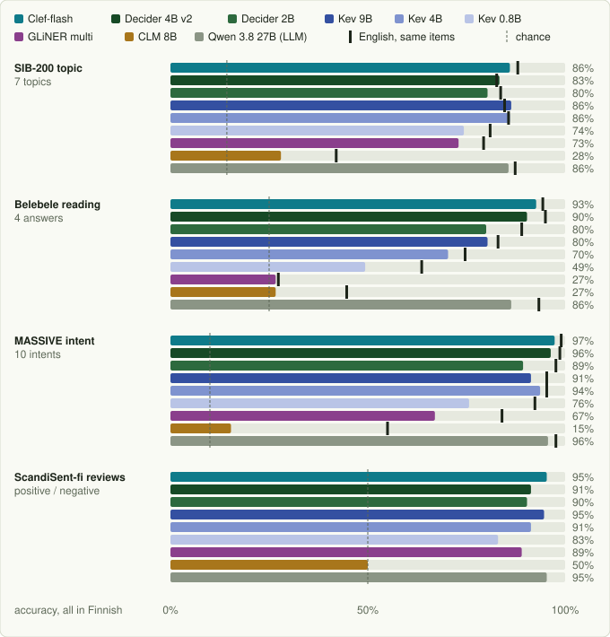

# Reading Finnish

> Generated from the same data as the interactive version, [`docs/finnish-report/index.html`](finnish-report/index.html), by `docs/finnish-report/build.py`. Every number per dataset and condition: [results/finnish/REPORT.md](../results/finnish/REPORT.md).

Can the open System One models be used on Finnish text? We asked eight of them, plus Qwen 3.8 27B as a reference, the same typed questions on four datasets, 300 items each: three where the same items exist in English and Finnish, and one written in Finnish. **Cloudflare's Clef-flash (9B) is the best model in Finnish, ahead of the 27B LLM, and three more order-blind models keep their English level close to the LLM.** The worst case, that none of them understands Finnish, did not happen.

## What we found

1. **Clef-flash is the best model in Finnish.** Averaged over the four datasets in Finnish it scores 0.928, ahead of the 27B LLM (0.907) and Decider 4B v2 (0.903); it loses only 1.8 points from English to Finnish on the same items, reads best (0.927 on Belebele in Finnish, LLM 0.863) and is well calibrated (ECE ≈ 0.03). Its option order never matters: Cloudflare's code sorts the options before building the input.
2. **Decider 4B v2, Kev 9B and Kev 4B lose about 2 points from English to Finnish** on the same items, less than the 27B LLM (3.6). Averaged over the four datasets in Finnish, Decider 4B v2 (0.903) is level with the LLM (0.907).
3. **Decider 4B v2 is the strongest of the other models**, and reads well too: 0.903 on Belebele reading comprehension in Finnish, against the LLM's 0.863. Its model card lists Belebele as held out of training.
4. **Kev 9B is the most language-neutral**: −1.7 points from English, and it ties the LLM on native Finnish reviews (0.947 vs 0.953). It is weaker than Decider 4B v2 on reading comprehension (0.803).
5. **Decider 2B works in Finnish but loses ~7 points** (10 on reading comprehension and intents). It stays the most order-blind of the models that read the options together, with calibrated probabilities (ECE ≤ 0.06 in Finnish), so it still suits a confidence cascade.
6. **The question language hardly matters.** A Finnish question is as good as an English one for every model except CLM, whose accuracy falls 11 points on average with Finnish option names (to chance on the reviews).
7. **Small and encoder models fall behind.** GLiNER2.5-multi-Decide is fine on binary sentiment (0.89) but at chance on reading comprehension even in English; Kev 0.8B loses 13 points; CLM is not usable in Finnish.

## Results at a glance

Everything in Finnish, accuracy on 300 items per dataset; the last column is the mean change from English to Finnish on the same SIB, Belebele and MASSIVE items, in points.

| Model | SIB-200 topic | Belebele reading | MASSIVE intent | ScandiSent-fi reviews | EN → FI, same items |
|---|--:|--:|--:|--:|--:|
| **Clef-flash** | 0.860 | 0.927 | 0.973 | 0.953 | -1.8 |
| **Decider 4B v2** | 0.833 | 0.903 | 0.963 | 0.913 | -2.1 |
| Decider 2B | 0.803 | 0.800 | 0.893 | 0.903 | -6.9 |
| **Kev 9B** | 0.863 | 0.803 | 0.913 | 0.947 | -1.7 |
| **Kev 4B** | 0.860 | 0.703 | 0.937 | 0.913 | -1.9 |
| Kev 0.8B | 0.743 | 0.493 | 0.757 | 0.830 | -12.6 |
| GLiNER multi | 0.730 | 0.267 | 0.670 | 0.890 | -8.0 |
| CLM 8B | 0.280 | 0.267 | 0.153 | 0.500 | -23.9 |
| *Qwen 3.8 27B (LLM)* | *0.857* | *0.863* | *0.957* | *0.953* | *-3.6* |

Decider was trained on MASSIVE's training split, so that column isn't zero-shot for Decider (see [Training data](#training-data)). Chance: 0.14 / 0.25 / 0.10 / 0.50.

## First filter: option order

We only consider models whose answer doesn't depend on the order the options are listed in: majority-voting over shuffled orders would multiply the cost and remove the speed advantage over an LLM. Every model answered the 300 tweets of the sentiment test with the three options in all six orders.

| Model | Answers that flip | Picks 1st / 2nd / 3rd | Accuracy when right answer is 1st / 2nd / 3rd | χ² p | Prefers a position? |
|---|--:|--:|--:|--:|---|
| Clef-flash | 0.0% | 33% / 33% / 33% | 0.62 / 0.62 / 0.62 | 1 | no |
| CLM 8B | 0.0% | 33% / 33% / 33% | 0.52 / 0.52 / 0.52 | 1 | no |
| jev | 5.0% | 33% / 34% / 33% | 0.73 / 0.75 / 0.73 | 0.66 | no |
| Decider 2B | 5.7% | 34% / 33% / 34% | 0.75 / 0.73 / 0.74 | 0.84 | no |
| Decider 4B v2 | 10.0% | 34% / 33% / 33% | 0.77 / 0.74 / 0.75 | 0.88 | no |
| GLiNER multi | 11.7% | 32% / 33% / 35% | 0.54 / 0.56 / 0.58 | 0.21 | no |
| Kev 4B | 12.0% | 32% / 33% / 34% | 0.63 / 0.64 / 0.65 | 0.63 | no |
| Kev 0.8B | 12.7% | 34% / 33% / 33% | 0.57 / 0.56 / 0.56 | 0.79 | no |
| Kev 9B | 12.7% | 32% / 32% / 35% | 0.67 / 0.67 / 0.71 | 0.26 | no |
| GLiNER 1B | 16.7% | 31% / 33% / 35% | 0.58 / 0.62 / 0.65 | 0.11 | no |
| SemIf | 19.3% | 34% / 33% / 34% | 0.72 / 0.71 / 0.72 | 0.85 | no |
| Laya | 22.0% | 37% / 32% / 31% | 0.69 / 0.61 / 0.59 | 0.0043 | favours the first option |
| GLiNER 340M | 23.0% | 39% / 33% / 28% | 0.71 / 0.63 / 0.56 | 6.1e-09 | favours the first option |

> GLiNER needed a fix before this test meant anything: gliner2's `Classifier` caches compiled schemas under a key that ignores label order, so a reordered label set reused the first order it had seen and every order looked identical. `adapters/gliner_systemone_server.py` now compiles each request itself. CLM's 0% is real: it embeds each option on its own. We ran the Finnish test on the models up to Kev 9B, plus GLiNER multi (the multilingual GLiNER; the English ones are English-only by design) and CLM.

## The test

Three of the datasets are **parallel**: the same items were translated into Finnish by people, so the difference between English and Finnish on identical items measures the language, not the task. ScandiSent-fi is **native** Finnish, a check that the models aren't only coping with translated text.

| Dataset | What | Options | English / Finnish | License |
|---|---|---|---|---|
| [SIB-200](https://huggingface.co/datasets/Davlan/sib200) | topic of a FLORES sentence | 7 topics | parallel, human translation | CC-BY-SA-4.0 |
| [Belebele](https://huggingface.co/datasets/facebook/belebele) | reading comprehension: passage, question, four answers | 4 answers | parallel, human translation | CC-BY-SA-4.0 |
| [MASSIVE](https://huggingface.co/datasets/mteb/amazon_massive_intent) | what a voice-assistant user wants (10 of the 60 intents, 30 each) | 10 intents | parallel, human localisation | CC-BY-4.0 |
| [ScandiSent-fi](https://huggingface.co/datasets/TurkuNLP/finbenchv2-scandisent-fi-mini) | Trustpilot reviews written in Finnish, balanced | positive / negative | native Finnish | see card |

Every item is asked in three ways, changing the language of the text and of the question (instructions, option names and descriptions). Answers are mapped back to the same gold labels.

| Condition | Text | Question | What it measures |
|---|---|---|---|
| `en` | English | English | the English score on the same items (parallel sets only) |
| `fi-en` | Finnish | English | one English question dict for every language |
| `fi` | Finnish | Finnish | everything in Finnish |

Every engine gets the same Jev request. A SIB-200 item in the all-Finnish condition:

```json
{
  "state": "Fissiopommi toimii periaatteella, että ...",
  "questions": {"q": {
    "type": "choice",
    "instructions": "Mikä on tämän tekstin aihe?",
    "criteria": {
      "tiede/teknologia": "tiede, tutkimus, teknologia tai tekniikka",
      "matkailu":         "matkustaminen, turismi, nähtävyydet ja liikkuminen matkailijana",
      "politiikka":       "hallinto, vaalit, lait ja kansainväliset suhteet",
      "urheilu":          "urheilu, urheilijat, ottelut ja kilpailut",
      "terveys":          "terveys, lääketiede, sairaudet ja keho",
      "viihde":           "elokuvat, musiikki, televisio, julkkikset, pelit ja taide",
      "maantiede":        "maat, maisemat, ilmasto, luonto ja paikat maapallolla"
    }}}
}
```

Belebele sends the passage as the state, its question inside the instructions, and the four answers as options A–D. The reference LLM gets the same instructions and options in its system prompt, the text as the user message, and must answer with one option name (JSON-schema enum, thinking off).

## Finnish, dataset by dataset

Everything in Finnish, accuracy on 300 items (±5 points of sampling noise). The tick on each bar is the same model's English accuracy on the same items; the dashed line is chance.



## How much Finnish costs

Accuracy change from English to Finnish on the same items, with a paired bootstrap 95% interval: much tighter than the ±5 points of each score, because both sides answer the same items.

| Model | SIB-200 topic | Belebele reading | MASSIVE intent |
|---|--:|--:|--:|
| Clef-flash | -2.0 [-5.0, +1.0] | -1.7 [-4.3, +1.0] | -1.7 [-3.7, +0.3] |
| Decider 4B v2 | +0.7 [-3.0, +4.3] | -4.7 [-7.3, -2.0] | -2.3 [-4.3, -0.3] |
| Decider 2B | -3.3 [-7.3, +0.7] | -9.0 [-13.0, -4.7] | -8.3 [-12.0, -5.0] |
| Kev 9B | +1.7 [-1.3, +4.7] | -2.7 [-6.7, +1.3] | -4.0 [-7.3, -0.3] |
| Kev 4B | +0.3 [-3.0, +3.7] | -4.3 [-7.3, -1.0] | -1.7 [-4.7, +1.3] |
| Kev 0.8B | -6.7 [-11.7, -1.3] | -14.3 [-20.3, -8.7] | -16.7 [-21.3, -11.7] |
| GLiNER multi | -6.3 [-11.3, -1.3] | -0.7 [-6.0, +4.7] | -17.0 [-22.3, -11.3] |
| CLM 8B | -14.0 [-21.3, -6.7] | -18.0 [-25.3, -11.0] | -39.7 [-45.3, -34.0] |
| Qwen 3.8 27B (LLM) | -1.7 [-4.3, +1.0] | -7.0 [-10.7, -3.3] | -2.0 [-4.0, -0.3] |

## Does the question have to be in Finnish?

Finnish text either way; the question (instructions, option names, descriptions) in English or in Finnish. Mean over the four datasets, and the largest single-dataset change.

| Model | EN question | FI question | Mean change | Largest change |
|---|--:|--:|--:|--:|
| Clef-flash | 0.926 | 0.928 | +0.3 | +1.0 (SIB-200 topic) |
| Decider 4B v2 | 0.903 | 0.903 | +0.0 | +1.7 (MASSIVE intent) |
| Decider 2B | 0.847 | 0.850 | +0.3 | +2.0 (MASSIVE intent) |
| Kev 9B | 0.887 | 0.882 | -0.6 | -2.0 (MASSIVE intent) |
| Kev 4B | 0.854 | 0.853 | -0.1 | +1.7 (MASSIVE intent) |
| Kev 0.8B | 0.672 | 0.706 | +3.4 | +14.7 (MASSIVE intent) |
| GLiNER multi | 0.636 | 0.639 | +0.3 | -1.3 (Belebele reading) |
| CLM 8B | 0.413 | 0.300 | -11.3 | -26.7 (ScandiSent-fi reviews) |
| Qwen 3.8 27B (LLM) | 0.910 | 0.907 | -0.3 | -2.7 (SIB-200 topic) |

## Calibration in Finnish

Expected calibration error in Finnish (lower is better): does a 0.8 answer turn out right 80% of the time? The LLM returns one label, not a distribution, so its ECE only reflects its error rate.

| Model | SIB-200 topic | Belebele reading | MASSIVE intent | ScandiSent-fi reviews |
|---|--:|--:|--:|--:|
| Clef-flash | 0.031 | 0.036 | 0.038 | 0.023 |
| Decider 4B v2 | 0.079 | 0.018 | 0.066 | 0.050 |
| Decider 2B | 0.061 | 0.053 | 0.026 | 0.060 |
| Kev 9B | 0.095 | 0.073 | 0.103 | 0.016 |
| Kev 4B | 0.116 | 0.105 | 0.167 | 0.043 |
| Kev 0.8B | 0.128 | 0.064 | 0.289 | 0.046 |
| GLiNER multi | 0.182 | 0.141 | 0.175 | 0.030 |
| CLM 8B | 0.485 | 0.422 | 0.470 | 0.476 |
| Qwen 3.8 27B (LLM) | 0.143 | 0.137 | 0.043 | 0.047 |

## Option order in Finnish

Belebele's correct answers are spread over A–D, which gives a free option-order check in Finnish: an order-blind model is level across the four positions (±~10 points with ~75 items per position).

| Model | A | B | C | D |
|---|--:|--:|--:|--:|
| Clef-flash | 0.88 | 0.91 | 0.95 | 0.96 |
| Decider 4B v2 | 0.88 | 0.87 | 0.91 | 0.94 |
| Decider 2B | 0.83 | 0.75 | 0.79 | 0.84 |
| Kev 9B | 0.77 | 0.77 | 0.87 | 0.80 |
| Kev 4B | 0.70 | 0.61 | 0.76 | 0.76 |
| Kev 0.8B | 0.49 | 0.47 | 0.41 | 0.61 |
| GLiNER multi | 0.23 | 0.10 | 0.39 | 0.34 |
| CLM 8B | 0.25 | 0.29 | 0.18 | 0.36 |
| Qwen 3.8 27B (LLM) | 0.84 | 0.82 | 0.90 | 0.89 |

## Training data

**Decider 4B v2** lists "MASSIVE (multilingual)" in its training mixture and marks massive-en-US as trained. Our items are from the test split and the card says evaluation rows were de-duplicated against training rows, but for Decider MASSIVE is a trained task, not zero-shot. **Belebele** is on its list of datasets kept out of training.

**Kev**'s card names banking77, BoolQ and AG News (English) among its "ten trained public sources"; none of the four sets here is named. SIB-200 (FLORES sentences) and ScandiSent are not listed for any model.

## All conditions

Accuracy per dataset and condition: **en** = English text and question; **fi-en** = Finnish text, English question; **fi** = everything in Finnish. Macro-F1 per cell: [results/finnish/REPORT.md](../results/finnish/REPORT.md).

| Model | SIB-200 en | SIB-200 fi-en | SIB-200 fi | Belebele en | Belebele fi-en | Belebele fi | MASSIVE en | MASSIVE fi-en | MASSIVE fi | ScandiSent-fi fi-en | ScandiSent-fi fi |
|---|--:|--:|--:|--:|--:|--:|--:|--:|--:|--:|--:|
| Clef-flash | 0.880 | 0.850 | 0.860 | 0.943 | 0.933 | 0.927 | 0.990 | 0.963 | 0.973 | 0.957 | 0.953 |
| Decider 4B v2 | 0.827 | 0.837 | 0.833 | 0.950 | 0.913 | 0.903 | 0.987 | 0.947 | 0.963 | 0.917 | 0.913 |
| Decider 2B | 0.837 | 0.817 | 0.803 | 0.890 | 0.790 | 0.800 | 0.977 | 0.873 | 0.893 | 0.907 | 0.903 |
| Kev 9B | 0.847 | 0.843 | 0.863 | 0.830 | 0.820 | 0.803 | 0.953 | 0.933 | 0.913 | 0.953 | 0.947 |
| Kev 4B | 0.857 | 0.860 | 0.860 | 0.747 | 0.717 | 0.703 | 0.953 | 0.920 | 0.937 | 0.920 | 0.913 |
| Kev 0.8B | 0.810 | 0.740 | 0.743 | 0.637 | 0.490 | 0.493 | 0.923 | 0.610 | 0.757 | 0.847 | 0.830 |
| GLiNER multi | 0.793 | 0.717 | 0.730 | 0.273 | 0.280 | 0.267 | 0.840 | 0.667 | 0.670 | 0.880 | 0.890 |
| CLM 8B | 0.420 | 0.257 | 0.280 | 0.447 | 0.267 | 0.267 | 0.550 | 0.363 | 0.153 | 0.767 | 0.500 |
| Qwen 3.8 27B (LLM) | 0.873 | 0.883 | 0.857 | 0.933 | 0.867 | 0.863 | 0.977 | 0.937 | 0.957 | 0.953 | 0.953 |

## Limits of this test

300 items per dataset give ±5 points per score, so read single-dataset differences of a few points as noise; the paired English → Finnish changes are tighter. The Finnish question wording is ours (`finnish_questions.py`), and three of the four datasets are translations from English, which can make them easier than native Finnish. Every model ran zero-shot, as released. Latency is not reported: the laptop GPU was shared during the runs and the LLM ran on another machine, so this test compares accuracy only. The same question dict went to every model; GLiNER does better on Belebele with the answers as option names instead of A–D (0.38–0.42 on 60 items) but stays far below the others.

---

Code: `adapters/export_finnish.py` (the four datasets), `finnish_questions.py` (the questions in both languages), `12_finnish_benchmark.py`, `13_finnish_report.py`, `llm_choice.py` (the LLM reference over any OpenAI-compatible server), `adapters/position_bias.py` + `11_position_bias.py` (option order). Local models on an Apple M5 with 32 GB; Qwen 3.8 27B (FP8) on a vLLM server.
