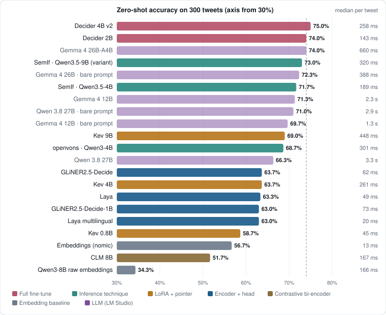

# Open-source Jev reproductions, zero-shot on real sentiment

> Generated from the same data as the interactive version, [`docs/page/index.html`](page/index.html), by `docs/page/build.py`.

Jev (TypeSafe AI, 15 Sept 2026) answers typed questions with probabilities instead of generating text. Within a week, dozens of open reproductions appeared. We take every well-ranked one that runs on a 32 GB Apple M5, plus newly released ones (Decider 4B v2, GLiNER2.5-Decide, CLM, Cloudflare's Clef-flash), ask each the **same sentiment question** about **300 human-labelled tweets**, and race them against local LLMs in LM Studio. The main comparison is **zero-shot**; a reference section documents three models we also trained on tweets.

|  |  |
|---|---|
| **75.0%** | best zero-shot System One: Decider 4B v2, 258 ms per tweet |
| **74.0%** | best local LLM: Gemma 4 26B-A4B, 660 ms per tweet |
| **0.056 vs 0.260** | calibration error, Decider 4B v2 vs the LLM (lower = honest probabilities) |
| **56.7%** | nearest label description by embeddings, for contrast |

## What a System One model does

You send a **state** (here, a tweet) and **typed questions** whose answer space you declare up front. You get back one answer per question with a probability for every option, from a single forward pass. Nothing is generated, so there is nothing to parse.

```python
SENTIMENT_QUESTION = {
    "type": "choice",
    "instructions": "What is the overall sentiment of this message?",
    "criteria": {
        "negative": "unhappy, angry, disappointed or critical",
        "neutral":  "factual or mixed, no clear feeling",
        "positive": "happy, grateful, excited or praising",
    },
}
# every engine receives exactly this dict, and returns e.g.
{"choice": "positive", "probabilities": {"negative": 0.01, "neutral": 0.04, "positive": 0.95}}
```

## The reproductions

They differ mainly in *how* they turn a language model into a chooser. Six families, at least one of each run here:

| Family | How it answers | Trains weights? | Run here |
|---|---|---|---|
| Encoder + head | encoder reads question + options + text; one marker per option is scored | whole model | Laya, Laya multilingual, GLiNER2.5-Decide (340M, 1B) |
| LoRA + pointer | causal LLM + LoRA; a decide token points at an option | adapter + head | Kev 0.8B / 4B / 9B |
| Full fine-tune | causal LLM trained to answer in an option letter | whole model | Decider 2B, Decider 4B v2 |
| Inference technique | **stock** LLM; lettered options, answer read from letter logits | nothing | SemIf, openvons |
| Contrastive bi-encoder | frozen LLM embeds text and each option **separately**; heads align them; softmax of cosine | projection heads | CLM 8B |
| Backbone + joint head | post-trained LLM; a small transformer head reads its final hidden states and scores all options of all questions **jointly** | whole model + head | Clef-flash (Cloudflare) |

Chosen from the [Jev Decision Index](https://huggingface.co/spaces/multimodalart/jev-decision-index) (31 reproductions, 37 benchmarks, run on a 96 GB NVIDIA card): the best-ranked ones that fit this laptop.

| Index # | Reproduction | Base model | On a 32 GB Mac |
|---|---|---|---|
| 1–4 | Jevfire, diffusiongemma open-jevs, Decider 35B-A3B | 26–36B | ✗ CUDA / vLLM, or Blackwell-only NVFP4 |
| 5 | Solomon v1.1 | Qwen3.8-27B | ✗ its MLX build needs ~60 GB |
| 6–7 | **Kev 9B, Kev 4B** | Qwen3.5-9B / 4B | ✓ MLX |
| 9 | open-jev (pngwn) | Qwen3.5-4B | ✗ weights without inference code |
| 10 | **openvons** | Qwen3-4B-Instruct | ✓ via mlx_lm.server |
| 11 | **SemIf** | Qwen3.5-4B-Base | ✓ native MLX |
| 12 | Decision-1.0-Nox | Qwen3.5-4B | ✗ AMD ROCm runtime |
| 13 | **Decider 2B** | Qwen3.5-2B | ✓ PyTorch MPS |
| 30 | **Laya** | ModernBERT-large | ✓ PyTorch MPS |
| new | **Decider 4B v2** (24 Sept) | Qwen3.5-4B | ✓ PyTorch MPS |
| new | **GLiNER2.5-Decide** 340M / 1B (the index ran older GLiNER 2.5) | DeBERTa-v3-large / 1B | ✓ PyTorch MPS |
| new | **CLM 8B** (24 Sept) | Qwen3-8B | ✓ vLLM encoder replaced by MLX (parity 0.9998) |
| new | **Clef-flash** 9B (Cloudflare, 1 Oct; the 27B Clef needs ~55 GB) | Qwen3.5-9B | ✓ PyTorch MPS, Cloudflare's own inference code |

## The dataset

[TweetEval sentiment](https://huggingface.co/datasets/cardiffnlp/tweet_eval) (SemEval-2017 Task 4A): short, noisy social-media messages labelled negative / neutral / positive by human annotators. A seeded, class-balanced sample of 100 per class from the **test** split, so always answering "neutral" scores 33%.

## Zero-shot results

Same 300 tweets, one per call, after a warm-up call. The LLMs get the same label descriptions in a system prompt and a JSON-schema `enum`, with thinking off. Nothing below was trained on tweets.



| System | Family | Accuracy | Macro-F1 | p50 | p95 | ECE |
|---|---|---|---|---|---|---|
| Decider 4B v2 | Full fine-tune | 75.0% | 0.751 | 258 ms | 296 ms | 0.056 |
| Decider 2B | Full fine-tune | 74.0% | 0.745 | 143 ms | 163 ms | 0.032 |
| Gemma 4 26B-A4B | LLM (LM Studio) | 74.0% | 0.736 | 660 ms | 894 ms | 0.260 |
| jev | Encoder + head | 73.7% | 0.723 | 260 ms | 355 ms | 0.154 |
| SemIf · Qwen3.5-9B (variant) | Inference technique | 73.0% | 0.707 | 320 ms | 349 ms | 0.080 |
| Gemma 4 26B · bare prompt | LLM (LM Studio) | 72.3% | 0.715 | 388 ms | 447 ms | 0.277 |
| SemIf · Qwen3.5-4B | Inference technique | 71.7% | 0.698 | 189 ms | 349 ms | 0.054 |
| Gemma 4 12B | LLM (LM Studio) | 71.3% | 0.714 | 2.3 s | 2.8 s | 0.287 |
| Qwen 3.8 27B · bare prompt | LLM (LM Studio) | 71.0% | 0.694 | 2.9 s | 4.7 s | 0.290 |
| Gemma 4 12B · bare prompt | LLM (LM Studio) | 69.7% | 0.695 | 1.3 s | 1.5 s | 0.303 |
| Kev 9B | LoRA + pointer | 69.0% | 0.695 | 448 ms | 498 ms | 0.052 |
| openvons · Qwen3-4B | Inference technique | 68.7% | 0.617 | 301 ms | 307 ms | 0.305 |
| Qwen 3.8 27B | LLM (LM Studio) | 66.3% | 0.656 | 3.3 s | 3.7 s | 0.337 |
| GLiNER2.5-Decide | Encoder + head | 63.7% | 0.635 | 62 ms | 72 ms | 0.061 |
| Kev 4B | LoRA + pointer | 63.7% | 0.646 | 261 ms | 307 ms | 0.107 |
| Laya | Encoder + head | 63.3% | 0.639 | 49 ms | 59 ms | 0.071 |
| GLiNER2.5-Decide-1B | Encoder + head | 63.0% | 0.632 | 73 ms | 82 ms | 0.081 |
| Laya multilingual | Encoder + head | 63.0% | 0.634 | 20 ms | 29 ms | 0.112 |
| Clef-flash | Backbone + joint head | 59.7% | 0.594 | 477 ms | 526 ms | 0.205 |
| Kev 0.8B | LoRA + pointer | 58.7% | 0.597 | 45 ms | 58 ms | 0.128 |
| Embeddings (nomic) | Embedding baseline | 56.7% | 0.537 | 13 ms | 16 ms | 0.071 |
| CLM 8B | Contrastive bi-encoder | 51.7% | 0.451 | 167 ms | 186 ms | 0.271 |
| Qwen3-8B raw embeddings | Embedding baseline | 34.3% | 0.193 | 166 ms | 178 ms | 0.213 |

±5 points of sampling noise at n = 300. ECE = expected calibration error of the top-class probability; an LLM returns a bare label, so its confidence is always 1.0 and its ECE equals its error rate. "Variant" = SemIf's technique on a 9B base, not an index configuration; "bare prompt" = the LLM without class descriptions.

> **Coverage.** Every model in the table above was run on all 300 tweets. Decider 4B v2, GLiNER2.5-Decide (340M, 1B) and CLM 8B were added later, after the option-order test and the cascade had been run, so those two sections cover only some of the models.

### Where the errors are

Rows = truth (100 each), columns = predicted.

| **Decider 4B v2** | → neg | → neu | → pos |
|---|---|---|---|
| negative | 86 | 14 | 0 |
| neutral | 15 | 78 | 7 |
| positive | 3 | 36 | 61 |

| **SemIf · Qwen3.5-4B** | → neg | → neu | → pos |
|---|---|---|---|
| negative | 91 | 8 | 1 |
| neutral | 34 | 41 | 25 |
| positive | 6 | 11 | 83 |

| **Kev 9B** | → neg | → neu | → pos |
|---|---|---|---|
| negative | 74 | 26 | 0 |
| neutral | 23 | 63 | 14 |
| positive | 3 | 27 | 70 |

| **Gemma 4 26B-A4B** | → neg | → neu | → pos |
|---|---|---|---|
| negative | 91 | 9 | 0 |
| neutral | 34 | 56 | 10 |
| positive | 5 | 20 | 75 |

Every model confuses polar tweets with neutral ones far more than negative with positive. Laya and Kev hedge towards "neutral"; stock-model letter techniques and LLMs push neutral tweets into a polarity; Decider is the most balanced.

### Does option order change the answer?

The same 300 tweets with the three options in all 6 orders (1,800 decisions per model):

|  | Laya | SemIf · 4B | Decider 2B | Clef-flash |
|---|---|---|---|---|
| Accuracy, correct answer listed 1st / 2nd / 3rd | 69 / 61 / 59% | 72 / 71 / 72% | 75 / 73 / 74% | 62 / 62 / 62% |
| Picks by position 1st / 2nd / 3rd (order-blind = 33/33/33) | 37 / 32 / 31% | 34 / 33 / 34% | 34 / 33 / 34% | 33 / 33 / 33% |
| Consistent preference? (χ² p) | **yes**, p = 0.00431 | no, p = 0.851 | no, p = 0.835 | no, p = 1 |
| Tweets whose answer changes with order alone | 22.0% | 19.3% | 5.7% | 0.0% |

Only Laya has a consistent pull (towards the first option). SemIf has no preferred position but flips almost a fifth of its answers. Decider, trained on shuffled options, is nearly order-blind; the bi-encoder CLM is order-blind by construction.

### The LLM prompt: with or without class descriptions

Same run with the bare instruction `Classify the following text to be either negative, neutral or positive.` followed by the tweet, same enum schema:

| LLM | With class descriptions | Bare prompt | Difference | Paired McNemar p |
|---|---|---|---|---|
| Gemma 4 26B-A4B | 74.0% · 660 ms | 72.3% · 388 ms | -1.7 | 0.38 |
| Gemma 4 12B | 71.3% · 2.3 s | 69.7% · 1.3 s | -1.7 | 0.41 |
| Qwen 3.8 27B | 66.3% · 3.3 s | 71.0% · 2.9 s | +4.7 | **0.013** |

Only Qwen's difference is real: with the descriptions it filed 25 positive tweets as neutral, without them 14.

### Isn't this just embeddings?

A natural simplification: embed each "label: description", embed the tweet, pick the closest. CLM is a trained version of that idea.

| Approach | Tweet and options read together? | Trained? | Accuracy | Macro-F1 |
|---|---|---|---|---|
| Qwen3-8B last-token embeddings + cosine | no, separately | no | 34.3% | 0.193 |
| nomic-embed-text + cosine | no, separately | no | 56.7% | 0.537 |
| Qwen3-8B + CLM's trained contrastive heads | no, separately | yes, general | 51.7% | 0.451 |
| best cross-encoder (Decider 4B v2) | **yes, one pass** | yes, general | 75.0% | 0.751 |

Embeddings encode the tweet without the question: one vector per text whatever you ask, compared by a single cosine. System One cross-encoders put question, options and tweet in one sequence, so each option is scored after the model has read this tweet under this question. CLM ranges 0.433–0.550 depending on option wording.

## How each family picks an answer

**Encoder + head (Laya).** Question, options and text go into one sequence; a `[MASK]` before each option is scored:

```
[CLS] choice question: What is the overall sentiment of this message? [SEP]
[MASK] negative: unhappy, angry, disappointed or critical      -> score for "negative"
[MASK] neutral: factual or mixed, no clear feeling             -> score for "neutral"
[MASK] positive: happy, grateful, excited or praising          -> score for "positive"
[SEP]
omg just got tickets for the show tonight!!! best day ever [SEP]
```

```python
h = encoder(input_ids).last_hidden_state              # ModernBERT-large
m = gather(head(h + type_emb(qtype)), marker_pos)     # one vector per option's [MASK]
p = softmax(scorer(m) / temperature)                  # scorer: MLP -> 1 number per option
```

**LoRA + pointer (Kev).** `<state> tweet` then per question `<q> instruction <opt> … </opt> … <decide>`; the `<decide>` state is dotted with each `</opt>` state: `z_i = (W_k h_opt_i) · (W_q h_decide) / sqrt(d)`.

**Letter logits (SemIf, openvons, Decider).** Relabel options A, B, C, run one forward pass, read the next-token logits of the letters. SemIf and openvons do it with a *stock* model; Decider is fine-tuned for it. Decider's "head" is the LM's own output layer restricted to the label tokens, a fixed 255 × 2048 slice (A–Z, AA, …) with unused letters masked, read at the final `(` of `… (A) … (B) … (C) … Answer: (`.

**One score per option, any number of options.** A classic classifier head is `Linear(hidden, N)`. A System One head outputs one number per option from a shared function, after one forward pass over the whole sequence:

| Model | What represents an option | Head | Width |
|---|---|---|---|
| Laya | `[MASK]` before each option | MLP → 1 number | any |
| GLiNER2.5-Decide | each label + description packed before the text | scorer on each label's token | any |
| Kev | each option's `</opt>` token | pointer: dot product with `<decide>` | any (≤ 255 by API) |
| Decider 2B / 4B v2 | label letter in the prompt | LM output rows for the letters, fine-tuned | fixed 255, masked |
| SemIf, openvons | label letter in the prompt | same letter logits, untrained | 16 / top-5 |
| CLM | option text embedded **alone** | projection MLPs → cosine | any |
| Clef-flash | options listed in the prompt, **sorted alphabetically** first | joint schema head over all options of all questions | up to 64 questions |

**One adapter per engine, one harness.** Engines that speak TypeSafe's `/v1/systemone` (Kev, CLM) get the question over HTTP; the others get a small adapter that reads the same `data/test_tweets.jsonl` and writes `{pred, probs, latency_ms}` per tweet, scored by the same code as everything else.

## Using the confidence: a cascade

Accept the System One answer when its top probability clears a threshold, otherwise ask the LLM:

| Decider 2B → Gemma 4 26B-A4B | Accuracy | Sent to LLM | Avg per tweet |
|---|---|---|---|
| System One only | 74.0% | 0% | 146 ms |
| ≥ 0.5 | 75.3% | 6% | 188 ms |
| ≥ 0.6 | 74.3% | 21% | 291 ms |
| ≥ 0.7 | 75.3% | 39% | 409 ms |
| ≥ 0.8 | 75.7% | 61% | 554 ms |
| ≥ 0.9 | 74.7% | 81% | 695 ms |
| LLM only | 74.0% | 100% | 669 ms |

| SemIf · Qwen3.5-4B → Gemma 4 26B-A4B | Accuracy | Sent to LLM | Avg per tweet |
|---|---|---|---|
| System One only | 71.7% | 0% | 204 ms |
| ≥ 0.5 | 74.0% | 15% | 301 ms |
| ≥ 0.6 | 73.7% | 31% | 411 ms |
| ≥ 0.7 | 74.0% | 44% | 499 ms |
| ≥ 0.8 | 73.7% | 56% | 573 ms |
| ≥ 0.9 | 74.3% | 72% | 681 ms |
| LLM only | 74.0% | 100% | 669 ms |

## For reference: the trained models

Not part of the main comparison (with labelled data you could train a classifier on embeddings instead), but it shows each architecture's ceiling. Same 3,000 training tweets, one epoch, temperature refitted on 300 validation tweets; test tweets unseen.

| Model | What was trained | Trainable params | Training on M5 | Saved | Zero-shot → trained | Macro-F1 | p50 / p95 | ECE |
|---|---|---|---|---|---|---|---|---|
| Laya | full model | 421M | ~10 min | 1.6 GB | 63.3% → **71.7%** | 0.711 | 49 ms / 66 ms | 0.048 |
| Kev 0.8B | LoRA + pointer head | 11.3M | ~40 min | 62 MB | 58.7% → **71.0%** | 0.701 | 43 ms / 47 ms | 0.057 |
| Kev 4B | LoRA + pointer head | 33.8M | ~90 min | 148 MB | 63.7% → **74.0%** | 0.739 | 185 ms / 189 ms | 0.040 |

## Takeaways

- **Zero-shot, the Decider models match the best local LLM.** Decider 4B v2 75.0% and Decider 2B 74.0% vs Gemma 4 26B-A4B 74.0%: a statistical tie (paired p ≈ 0.8), at 2.6× and 4.6× lower latency, with honest probabilities. On this task the 2B is the better deal.
- **One task is not enough to rank these models.** Cloudflare's Clef-flash is the best model in our Finnish and Snake tests, but here scores 59.7%: it calls about two thirds of the tweets neutral, whatever the question ID or label wording (0.60–0.62). Its option order never matters: its code sorts the options first.
- **Letter logits are the strongest readout here.** Even a *stock* base model read that way gets 71.7% (SemIf 4B) and 73.0% (9B); pointer and marker heads trail (Kev 9B 69.0%, Laya 63.3%).
- **The base model matters as much as the technique.** The same idea on an instruct model (openvons) reaches 68.7% but almost never says "neutral" (macro-F1 0.617) and is over-confident (ECE 0.305).
- **Bigger isn't automatically better within a family.** GLiNER2.5-Decide-1B (63.0%) doesn't beat the 340M (63.7%); Decider 4B v2 only ties the 2B.
- **It isn't just embeddings.** Nearest description by cosine: 56.7%; CLM's trained contrastive heads: 51.7%. Reading question, options and text together is where the accuracy comes from.
- **Option order matters for some models.** Laya favours whatever is listed first; SemIf flips ~19% of answers; Decider flips 6%.
- **Label descriptions are a model-specific lever.** No effect on the Gemma models, +4.7 points for Qwen 3.8 27B without them.
- **One schema everywhere.** The same question dict drove every engine: in-process, over HTTP, or through a 30-line adapter.

## Run it yourself

See the [README](../README.md) for setup, step-by-step commands and the key-code docs ([1](1-landscape.md), [2](2-typed-questions.md), [3](3-benchmark-method.md), [4](4-zero-shot-reproductions.md)).

---
*Measured 23–26 Sept 2026 on an Apple M5 with 32 GB RAM. Laya, Decider and GLiNER on PyTorch MPS; Kev and SemIf on MLX; openvons on mlx_lm.server; CLM with an MLX encoder; LLMs in LM Studio. Index ranks from Decision Index edition 0.1 (22 Sept 2026). 300 tweets means roughly ±5 points of noise; read small gaps as ties.*
