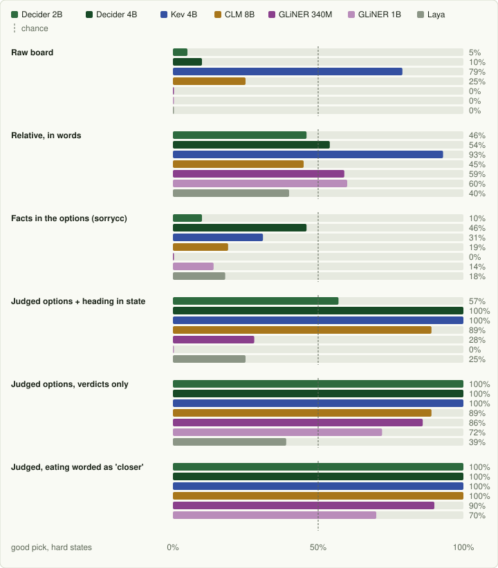

# Asking for a Snake Move

> Generated from the same data as the interactive version, [`docs/snake-report/index.html`](snake-report/index.html), by `docs/snake-report/build.py`. Key code and details: [docs/5-snake.md](5-snake.md).

People posted Jev playing Snake. We read how six of those demos phrase each move, then put the same requests to eight open System One models on one laptop, zero-shot, 10 games per model and request. **The fast, straight-to-the-food videos rely on code for the geometry.** Asked to read the board themselves, the models are poor at it, and so is Jev. Given one verdict per option, six of the eight play well, but each one needs the wording to suit it. And once the options carry verdicts, seven keyword rules with no model play as well as any of them.

## What we found

1. **The simple way fails, for Jev and for the open models.** The only published numbers of Jev playing (nadeem4's arena) are 1.8 food per game against 17.3 for a few lines of greedy code; it circled until it starved. On the raw board, five of the seven models tried died within about 9 steps in every game; with nadeem4's phrasing or sorrycc's facts they circled and starved. Two models partly read the board: Kev 4B (13.1 food with nadeem4's phrasing) and Clef-flash, which picks a good move on 85% of the hard raw-board states, but both still die or starve every game.
2. **The demos that look good move the spatial work into code**: filtering out fatal moves, flood-fill facts, confidence gates, or a waypoint pathfinder that steers every tick while Jev only picks a target every 2.6 seconds. CLM's own game demo does the same.
3. **What works: one verdict per option, and nothing else in the state.** Code writes "moves closer to the food; keeps the most room" into each option. For five models the best such request picks a good single move 95–99% of the time (90–100% on the hard states). Three things had broken them: numbers to compare across options, direction words in the state, and, for two models, the word "eats".
4. **The wording has to suit the model.** CLM 8B and GLiNER 340M give any option that says "eats the food" almost no probability, so they circle next to the food. Worded as "moves closer to the food", CLM goes from 0 to 36.2 food per game and GLiNER from 2.7 to 26.3. For the other models it makes little difference.
5. **Better single moves don't mean longer games.** Decider 4B and Kev 4B are more decisive than Decider 2B and follow "closer to the food" into tight spaces: they die in 9 and 10 of 10 games, Decider 2B in 2. With 36.9 food per game, Decider 2B was the best model until Cloudflare's Clef-flash: 39.3 food per game with judged options and no death in 10 games, close to the best code baseline (41.1).
6. **Speed varies 60-fold.** CLM answers in ~4 ms once its cache is warm (10 games in 16 s), GLiNER in 70–80 ms, Kev in ~110, Decider 2B in ~145, Decider 4B in ~260 and Clef-flash in ~520 ms per move. ximing's extra questions roughly double that, and on those rows code picks up to two moves in three.
7. **A table of phrases does as well.** Once each option carries a verdict, adding up points for seven phrases, with no model at all, picks a good move on 100% of the hard states and eats 39.0 food per game without dying, level with the best model (Clef-flash, 39.3). In Snake the model doesn't need to be smart: code has already done the understanding when it wrote the options.

## The eight models

All zero-shot, as released: the same models as in the sentiment benchmark. Every one answers the same Jev request, `{state, questions}`, and returns a probability per option. They differ in how they read it, which turns out to matter here.

| Model | How it reads the request | Runs here as | Sentiment |
|---|---|---|--:|
| Clef-flash | Cloudflare's post-trained Qwen3.5-9B: a joint schema head reads the final hidden states and scores the options of all questions together; options are sorted before encoding | own environment, `/v1/systemone` adapter (PyTorch MPS) | 59.7% |
| Decider 2B | Qwen3.5-2B fine-tune: state, question and lettered options in one sequence; answer from the letter logits | in-process, PyTorch MPS | 74.0% |
| Decider 4B v2 | the same, on Qwen3.5-4B | in-process, PyTorch MPS | 75.0% |
| Kev 4B | LoRA on Qwen3.5-4B-Base; a pointer head scores each option's end token | its own `/v1/systemone` server (MLX) | 63.7% |
| CLM 8B | bi-encoder: frozen Qwen3-8B embeds state + question and each option *separately*; softmax over cosines | `clm-serve`, Qwen3-8B on MLX | 51.7% |
| GLiNER 340M | GLiNER2.5-Decide, a DeBERTa-v3-large schema encoder: question and all labels packed before the text | own environment, `/v1/systemone` adapter | 63.7% |
| GLiNER 1B | GLiNER2.5-Decide-1B, the larger variant | own environment, `/v1/systemone` adapter | 63.0% |
| Laya | ModernBERT-large encoder (421M) with a `[MASK]` marker per option | in-process, PyTorch MPS | 63.3% |

Sentiment: zero-shot accuracy on 300 tweets, from the companion benchmark ([sentiment-report.md](sentiment-report.md)). Laya played games on two requests only (facts and judged options); it can't play with either.

## Best result per model

Each model's best request among those where the model decides every move (so not "composed", where code steps in when the model is unsure). 10 games each, 12×12 board, 500-step cap.

| Model | Best request | Food / game | Best game | Died | Per move | Probe, hard states |
|---|---|--:|--:|--:|--:|--:|
| **Clef-flash** | Judged options | 39.3 | 45 | 0 of 10 | 516 ms | 100% |
| **Decider 2B** | Judged options | 36.9 | 46 | 2 of 10 | 145 ms | 100% |
| **CLM 8B** | Judged, plain wording | 36.2 | 44 | 5 of 10 | 4 ms | 100% |
| **Decider 4B** | Judged, plain wording | 30.8 | 43 | 9 of 10 | 260 ms | 100% |
| **Kev 4B** | Judged options | 29.5 | 41 | 10 of 10 | 108 ms | 100% |
| GLiNER 340M | Judged, plain wording | 26.3 | 37 | 5 of 10 | 70 ms | 90% |
| GLiNER 1B | Judged options | 15.3 | 25 | 4 of 10 | 82 ms | 72% |
| Laya | Facts in the options | 0.5 | 2 | 0 of 10 | 100 ms | 18% |
| *code only* | *greedy + dead-end check* | *41.1* | *44* | *2 of 10* | – | – |

## How the published demos ask

Every demo sends the same Jev request: a `state` plus one typed `choice` question per tick. What differs is how much has already been decided by code before the model sees the options. From model-reads-the-board to code-does-the-pathing:

| Demo | State sent | Options | Code decides |
|---|---|---|---|
| [iammusham](https://github.com/iammusham/jev-snake) | coordinates, body, walls, danger cells (JSON) | `UP` "Move one cell in negative y", ×4 | nothing |
| [nadeem4](https://github.com/nadeem4/jev-demo) | "food: 3 cells ahead and 2 to your right", "if_you_turn_left: clear for 4 cells, then the wall" | `TURN_LEFT` `STRAIGHT` `TURN_RIGHT` | nothing (Jev: 1.8 food / game) |
| [coderhh](https://github.com/coderhh/jev-snake) | text grid, heading | only non-fatal directions | fatal-move filter; override for Laya |
| [sorrycc](https://github.com/sorrycc/typesafe-snake) | text grid, head, food, heading | safe directions with facts: "food is 8 steps away after this move; 141 of 141 empty cells stay reachable" | filter, flood fill |
| [ximing](https://github.com/ximing/jev-snake-game) | grid + per-candidate facts | move choice, danger score, survival noul, safe + progress noul per direction | filter, thresholds + fallbacks |
| [StevanusPangau](https://github.com/StevanusPangau/jev-snake) | snapshot + waypoints | `food` / `open_area` / `border_loop` | every tick: greedy pathing + BFS seatbelt |

## Six ways of asking

Four requests reproduce published demos; two are written here from what the probe below showed. All are in `snake/formulations.py`.

| Request | Based on | What the model gets |
|---|---|---|
| Raw board | iammusham, coderhh | the board as text rows, head and food coordinates; options up / left / right, fatal ones included |
| Relative, in words | nadeem4, verbatim | phrases about the food and what lies left, ahead and right; options `TURN_LEFT` / `STRAIGHT` / `TURN_RIGHT` |
| Facts in the options | sorrycc, verbatim | board and heading; only safe moves, each with exact numbers (food distance, reachable cells, dead end) |
| Judged options | sorrycc's facts, rewritten | no state; only safe moves, each with a verdict in words |
| Judged, plain wording | judged options | the same, with the eating move worded "moves closer to the food" |
| Composed questions | ximing | judged options plus a danger score and a survival yes/no in one request; code combines them with thresholds |

## One decision, known answer

Games mix many effects, so we first asked for single moves on fixed situations where code knows the good moves: not a dead end, and as close to the food as any non-dead-end move. The chart shows the **hard** set, 100 states where going straight is legal but wrong. Chance is about 50%.



| Request | Clef-flash | Decider 2B | Decider 4B | Kev 4B | CLM 8B | GLiNER 340M | GLiNER 1B | Laya | Decider 2B latency |
|---|--:|--:|--:|--:|--:|--:|--:|--:|--:|
| Raw board | 0.87 / 0.85 | 0.59 / 0.05 | 0.63 / 0.10 | 0.93 / 0.79 | 0.45 / 0.25 | 0.58 / 0.00 | 0.58 / 0.00 | 0.58 / 0.00 | 353 ms |
| Relative, in words | 0.80 / 0.70 | 0.69 / 0.46 | 0.69 / 0.54 | 0.84 / 0.93 | 0.35 / 0.45 | 0.38 / 0.59 | 0.65 / 0.60 | 0.47 / 0.40 | 184 ms |
| Facts in the options (sorrycc) | 0.83 / 0.75 | 0.68 / 0.10 | 0.74 / 0.46 | 0.74 / 0.31 | 0.64 / 0.19 | 0.65 / 0.00 | 0.60 / 0.14 | 0.52 / 0.18 | 532 ms |
| Judged options + heading in state | 1.00 / 1.00 | 0.73 / 0.57 | 0.99 / 1.00 | 0.99 / 1.00 | 0.93 / 0.89 | 0.80 / 0.28 | 0.69 / 0.00 | 0.73 / 0.25 | 185 ms |
| **Judged options, verdicts only** | 0.99 / 1.00 | 0.99 / 1.00 | 0.99 / 1.00 | 0.99 / 1.00 | 0.93 / 0.89 | 0.93 / 0.86 | 0.81 / 0.72 | 0.61 / 0.39 | 142 ms |
| **Judged, eating worded as 'closer'** | 0.99 / 1.00 | 0.98 / 1.00 | 0.99 / 1.00 | 0.99 / 1.00 | 0.99 / 1.00 | 0.95 / 0.90 | 0.79 / 0.70 | – | 140 ms |

Cells: good pick on all 150 states / on the 100 hard states. Kev 4B is the only model that reads the raw board (93%). Laya stays below chance on the hard states with every request.

## What breaks the models

### Numbers to compare across options

sorrycc's options carry exact numbers, and no model does well with them when going straight is wrong (hard states: 0–46%). The same facts written as a verdict in each option lift every model, and all but Laya to 72–100%. On Decider 2B, spelling the rule out in the instruction helped only partly (67% → 82% on all states); writing the comparison into each option, as words ("moves closer to the food") or as before→after numbers ("distance changes from 9 to 8"), reached 98–99%.

### Direction words in the state

Judged options with `heading: up` and "the food is 5 down and 5 right" in the state, against the same options with no state (hard states):

| Heading in the state? | Decider 2B | Decider 4B | Kev 4B | CLM 8B | GLiNER 340M | GLiNER 1B | Laya |
|---|--:|--:|--:|--:|--:|--:|--:|
| yes | 57% | 100% | 100% | 89% | 28% | 0% | 25% |
| **no** | **100%** | **100%** | **100%** | **89%** | **86%** | **72%** | **39%** |

The two 4B models and CLM ignore the heading; for the smaller models it pulls hard toward going straight, even when that option reads "moves away from the food". On Decider 2B, renaming the options from `up/down/left/right` to `move 1/2/3` changed nothing: it's the context that pulls.

sorrycc's facts, as Decider reads them (67% good):

```text
Context:
{"board": [..12 rows..], "legend": "H = snake head, ...",
 "head": {"row": 4, "col": 9}, "food": {"row": 8, "col": 4},
 "heading": "right", "snake_length": 3, ...}

Question: You are playing the game Snake. Choose the direction ... Player strategy: Stay alive and eat food.
Options:
(A) up: left turn, head moves to row 3 col 9; food is 10 steps away after this move; 141 of 141 empty cells stay reachable; can still follow its own tail out
(B) down: right turn, head moves to row 5 col 9; food is 8 steps away after this move; 141 of 141 ...
(C) right: straight, head moves to row 4 col 10; food is 10 steps away after this move; 141 of 141 ...
Answer: (
```

Judged options, same situation (99% good):

```text
Context:
Choose the best move for the snake.

Question: Snake game: pick the next move. Every listed move is safe for this step. Never take a DEAD END. Prefer a move that eats the food or moves closer to it, unless it leaves much less room than another move. Player strategy: Stay alive and eat food.
Options:
(A) up: moves away from the food; keeps the most room
(B) down: moves closer to the food; keeps the most room
(C) right: moves away from the food; keeps the most room
Answer: (
```

Decider scores the logits of the letters `A`, `B`, `C` right after the final `(` and applies its temperature (1.3); nothing is generated. Code has done the geometry: which moves survive, distance before and after, flood-fill room, dead ends. The model weighs the verdicts against the instruction and the player's strategy text, the only step that responds to natural language.

### The word "eats"

Two models almost never pick an option that says "eats the food", so with judged options they circle next to the food until they starve:

| Food per game | Decider 2B | Decider 4B | Kev 4B | CLM 8B | GLiNER 340M | GLiNER 1B |
|---|--:|--:|--:|--:|--:|--:|
| "eats the food" | 36.9 | 29.3 | 29.5 | 0.0 | 2.7 | 15.3 |
| "moves closer to the food" | 34.9 | 30.8 | 25.3 | **36.2** | **26.3** | 13.7 |

Both are models that score option text by matching it. CLM embeds each option on its own, so an option can't see the others: two options with identical text get identical probabilities. On 80 states where one move eats the food, CLM picked it 0% of the time with every wording tried ("eats the food", "reaches the food", "moves onto the food", "moves closer to the food and eats it"), and 97% once it read "moves closer to the food; keeps the most room", which is true, since the distance drops to 0. CLM's own game demo, [T-Rex runner vs Jev](https://github.com/Contrastive-LM/CLM/tree/main/examples/t_rex), also labels every action for the model (`jump: Safe. Clears the 2 large cacti. Best.`) and lets a shield replace unsafe answers; there CLM agreed with the planner on 66% of decisions and Jev on 99%.

## Full games

Same 10 seeds for every row, 12×12 board. A game ends on death, after 144 steps without food (starved), or at 500 steps. Raw board and relative phrasing let the model pick fatal moves; the other requests only offer safe ones.

| Controller | Food / game | Best | Steps | Ended by | Per move, p50 / mean |
|---|--:|--:|--:|---|--:|
| Clef-flash · Raw board | 6.5 | 15 | 64 | died 10 | 750 / 756 ms |
| Clef-flash · Relative, in words | 0.5 | 3 | 147 | starved 10 | 528 / 531 ms |
| Clef-flash · Facts in the options | 3.8 | 13 | 177 | starved 9, died 1 | 960 / 944 ms |
| **Clef-flash · Judged options** | 39.3 | 45 | 500 | step cap (500) 10 | 516 / 516 ms |
| **Clef-flash · Judged, plain wording** | 35.9 | 45 | 444 | step cap (500) 8, died 2 | 516 / 517 ms |
| Clef-flash · Composed questions | 40.0 | 44 | 481 | step cap (500) 7, died 3 | 953 / 941 ms |
| Decider 2B · Raw board | 0.0 | 0 | 7 | died 10 | 357 / 358 ms |
| Decider 2B · Relative, in words | 0.1 | 1 | 145 | starved 10 | 185 / 185 ms |
| Decider 2B · Facts in the options | 1.2 | 4 | 175 | starved 10 | 448 / 456 ms |
| **Decider 2B · Judged options** | 36.9 | 46 | 477 | step cap (500) 8, died 2 | 141 / 145 ms |
| **Decider 2B · Judged, plain wording** | 34.9 | 46 | 459 | died 5, step cap (500) 5 | 140 / 141 ms |
| Decider 2B · Composed questions | 38.3 | 44 | 486 | step cap (500) 8, died 2 | 308 / 311 ms |
| Decider 4B · Raw board | 0.1 | 1 | 9 | died 10 | 557 / 556 ms |
| Decider 4B · Relative, in words | 0.0 | 0 | 144 | starved 10 | 310 / 312 ms |
| Decider 4B · Facts in the options | 3.6 | 7 | 211 | starved 10 | 813 / 773 ms |
| **Decider 4B · Judged options** | 29.3 | 43 | 312 | died 9, step cap (500) 1 | 257 / 259 ms |
| **Decider 4B · Judged, plain wording** | 30.8 | 43 | 332 | died 9, step cap (500) 1 | 261 / 260 ms |
| Decider 4B · Composed questions | 32.7 | 40 | 380 | died 7, step cap (500) 3 | 502 / 504 ms |
| Kev 4B · Raw board | 9.0 | 17 | 92 | died 10 | 265 / 268 ms |
| Kev 4B · Relative, in words | 13.1 | 22 | 166 | died 10 | 207 / 208 ms |
| Kev 4B · Facts in the options | 17.2 | 25 | 411 | step cap (500) 6, starved 4 | 332 / 334 ms |
| **Kev 4B · Judged options** | 29.5 | 41 | 321 | died 10 | 108 / 108 ms |
| Kev 4B · Judged, plain wording | 25.3 | 34 | 251 | died 10 | 108 / 110 ms |
| CLM 8B · Raw board | 0.0 | 0 | 7 | died 10 | 284 / 254 ms |
| CLM 8B · Relative, in words | 0.0 | 0 | 144 | starved 10 | 0 / 5 ms |
| CLM 8B · Facts in the options | 1.8 | 6 | 167 | starved 9, died 1 | 0 / 295 ms |
| CLM 8B · Judged options | 0.0 | 0 | 144 | starved 10 | 0 / 0 ms |
| **CLM 8B · Judged, plain wording** | 36.2 | 44 | 461 | died 5, step cap (500) 5 | 0 / 4 ms |
| CLM 8B · Composed questions | 0.0 | 0 | 144 | starved 10 | 0 / 0 ms |
| GLiNER 340M · Raw board | 0.0 | 0 | 7 | died 10 | 256 / 256 ms |
| GLiNER 340M · Relative, in words | 0.0 | 0 | 144 | starved 10 | 102 / 103 ms |
| GLiNER 340M · Facts in the options | 0.4 | 2 | 153 | starved 10 | 373 / 375 ms |
| GLiNER 340M · Judged options | 2.7 | 15 | 181 | starved 10 | 72 / 71 ms |
| GLiNER 340M · Judged, plain wording | 26.3 | 37 | 371 | died 5, step cap (500) 4, starved 1 | 71 / 70 ms |
| GLiNER 340M · Composed questions | 39.4 | 44 | 497 | step cap (500) 9, died 1 | 169 / 166 ms |
| GLiNER 1B · Raw board | 0.0 | 0 | 7 | died 10 | 268 / 273 ms |
| GLiNER 1B · Relative, in words | 1.7 | 6 | 121 | starved 7, died 3 | 123 / 123 ms |
| GLiNER 1B · Facts in the options | 0.3 | 1 | 151 | starved 10 | 317 / 320 ms |
| GLiNER 1B · Judged options | 15.3 | 25 | 315 | starved 4, died 4, step cap (500) 2 | 84 / 82 ms |
| GLiNER 1B · Judged, plain wording | 13.7 | 24 | 324 | starved 6, died 3, step cap (500) 1 | 81 / 82 ms |
| GLiNER 1B · Composed questions | 3.8 | 8 | 235 | starved 10 | 196 / 196 ms |
| Laya · Facts in the options | 0.5 | 2 | 155 | starved 10 | 100 / 100 ms |
| Laya · Judged options | 0.0 | 0 | 144 | starved 10 | 38 / 39 ms |
| *code only: random safe move* | 0.5 | 2 | 175 | starved 10 | – |
| *code only: greedy* | 21.0 | 32 | 213 | died 10 | – |
| *code only: greedy + dead-end check* | 41.1 | 44 | 484 | step cap (500) 8, died 2 | – |

> Most judged, composed and greedy + dead-end games reach the 500-step cap, so their food counts are capped too. The code baselines use the same facts the judged options are written from, so the judged request doesn't beat code at Snake. It matches code while the move stays a model decision, one you can steer with the strategy text.

### Better single moves, shorter games

On the probe, Decider 4B and Kev 4B match Decider 2B and are more decisive (84–91% of the probability on good moves, against 71%). In games they die far more. Replaying their judged games shows why: they follow "closer to the food" and skip "unless it leaves much less room".

| Judged options | Took "leaves much less room" when a roomier move existed | Took "moves away" when closer was on offer | Died |
|---|--:|--:|--:|
| **Decider 2B** | 6% (4 of 70) | 4.6% | 2 of 10 |
| Decider 4B | 26% (11 of 43) | 0.5% | 9 of 10 |
| Kev 4B | 58% (22 of 38) | 0.2% | 10 of 10 |

### Speed

CLM is nearly free once warm: with judged options the state is a fixed sentence and the verdicts come from a handful of strings, so after the first ticks every vector is in its cache (~4 ms per move, 10 games in 16 s). With texts that change every tick (facts in the options) a call costs ~300 ms, mostly the 8B encoder. Its latency medians in the table mostly measure cache hits. The other models spend the same time on every move: GLiNER 70–80 ms, Kev ~110 ms, Decider 2B ~145 ms, Decider 4B ~260 ms.

### Composed questions: who actually moves

ximing's gate hands the move to code when the model is under 0.55 confident, and switches to "most room" when the model reports danger. The flatter a model's probabilities, the more of the game code plays:

| Composed questions | Food / game | Model's choice | Code: model unsure | Code: survival mode | Code: one safe move |
|---|--:|--:|--:|--:|--:|
| Clef-flash | 40.0 | 59% | 33% | 0% | 8% |
| GLiNER 340M | 39.4 | 33% | 59% | 0% | 7% |
| Decider 2B | 38.3 | 50% | 43% | 0% | 7% |
| Decider 4B | 32.7 | 67% | 26% | 0% | 7% |
| GLiNER 1B | 3.8 | 41% | 54% | 0% | 5% |
| CLM 8B | 0.0 | 0% | 0% | 97% | 3% |

GLiNER 340M's 39.4 food is the best model row, but code chose two moves in three, close to what code alone scores (41.1). CLM answers the danger and survival questions as if the snake were always in trouble, so the gate stays in survival mode, takes the roomiest move, and never eats; composed also uses the "eats" wording. CLM's best is judged, plain wording: 36.2 food at ~4 ms per move.

## The request that works

Sent once per tick when at least two moves survive; with one safe move, code takes it without calling the model.

```json
{
  "state": "Choose the best move for the snake.",
  "questions": {"move": {
    "type": "choice",
    "instructions": "Snake game: pick the next move. Every listed move is safe for this step. Never take a DEAD END. Prefer a move that eats the food or moves closer to it, unless it leaves much less room than another move. Player strategy: Stay alive and eat food.",
    "criteria": {
      "up":    "moves away from the food; keeps the most room",
      "down":  "moves closer to the food; keeps the most room",
      "right": "moves away from the food; keeps the most room"
    }}}
}
```

Verdicts come from `snake/formulations.py` (`judge()`): *eats the food* / *moves closer* / *moves away*, then *DEAD END* (flood fill smaller than the snake and no way to follow the tail), *keeps the most room*, *keeps almost as much room* (≥ 80%), or *leaves much less room (n of m cells)*. For CLM and GLiNER 340M, use the plain wording, which describes the eating move as "moves closer to the food; keeps the most room".

## Without a model: a keyword scorer

The judged options are code's facts written in a small, fixed vocabulary, so the words can be read back without a model. `KeywordEngine` (`snake/engine.py`) answers the same `{state, questions}` request: it adds up points for the phrases each option contains, then takes the top score (random tie-break) or samples from a softmax over the scores. The weights were written once and not tuned; matching ignores case.

| Phrase in the option | Points |
|---|--:|
| `eats the food`, `moves closer to the food` | +3 |
| `moves away from the food` | −1 |
| `keeps the most room` / `keeps almost as much room` | +2 / +1 |
| `leaves much less room (N of M cells)` | −2 − 2·(1 − N/M) |
| `dead end` | −100 |

| Controller | Food / game | Best | Died | Probe, hard states |
|---|--:|--:|--:|--:|
| **Keyword scorer, top score · Judged options** | 39.0 | 45 | 0 of 10 | 100% |
| **Keyword scorer, top score · Judged, plain wording** | 38.3 | 42 | 2 of 10 | 100% |
| Keyword scorer, sampled T=0.5 · Judged options | 39.1 | 44 | 1 of 10 | 100% |
| Keyword scorer, sampled T=0.5 · Judged, plain wording | 35.3 | 42 | 2 of 10 | 100% |
| Keyword scorer, sampled T=1 · Judged options | 37.0 | 42 | 1 of 10 | 96% |
| Keyword scorer, sampled T=1 · Judged, plain wording | 33.7 | 44 | 5 of 10 | 99% |
| *Decider 2B · Judged options (best model)* | 36.9 | 46 | 2 of 10 | 100% |
| *code only: greedy + dead-end check* | 41.1 | 44 | 2 of 10 | – |

On the other requests there is nothing to match, so it plays at random among the offered moves, which is no worse than most models there. Food per game, top score: facts in the options 1.3 (starved 10), relative, in words 0.2 (died 10), raw board 0.2 (died 10).

### What this says

a) **The models don't need to be smart here.** Choosing between "moves closer to the food; keeps the most room" and "moves away from the food; DEAD END" takes a few string lookups. The best billion-parameter models only match the table, and the smaller ones fall short of it for reasons that have nothing to do with Snake: the word "eats", or a heading in the state.

b) **This is how the models worked anyway.** Every request that worked is one where code had already reduced the choice to reading back its own verdicts. Every request that asked for more (read a board, compare numbers across options, ignore a heading) failed. The failures look like text matching: CLM and GLiNER 340M avoid "eats" even when eating is right, and the small models follow `heading: up` towards going straight. The published demos that play well are built the same way: the geometry is done in code before the model is called.

c) **If code has to describe the world, it can often decide too.** To write "moves closer to the food; keeps the most room", code already needs the distances, the flood fill and the dead-end test. The last step, from those facts to a move, is a few lines: exact, testable, and well under a millisecond. Greedy + dead-end check (41.1) is that step written directly. What a model adds is what the table ignores: the player's strategy text, and any wording nobody wrote a phrase for.

> Snake is a small closed world with a handful of cases, and code writes every word of every option, so a phrase table covers them all. Where the description is open (free text from people, many interacting factors, options nobody listed in advance), a table would not keep up, and that is where a System One model could earn its place. This test doesn't cover such cases.

## Limits of this test

We had no TypeSafe API key, so hosted Jev is represented only by nadeem4's published run (10 games, 10×10, relative phrasing, starvation after 60 steps without food). That setup differs from ours (12×12, 144 steps), so compare the 1.8 with our rows only loosely. Every model runs zero-shot, as released. The probe's "good move" only checks food distance and dead ends, not room, which is why it misses the 4B models' habit of chasing food into tight spaces. Some diagnostics were run on one model only: the instruction-rule and option-renaming tests (Decider 2B), the 80-state "eats" test (CLM) and the tight-space replay (the three models shown). Ten seeds per row give wide intervals, so read differences of a few food as noise, and most of the best games hit the 500-step cap. The keyword scorer shows only that Snake's judged options can be read back by rules, not that the same holds for tasks whose descriptions aren't generated by code from a fixed vocabulary.

---

Code: `snake/`, `08_snake_server.py` (live demo with the decision panel), `09_snake_benchmark.py`, `10_snake_probe.py`, `adapters/gliner_systemone_server.py`, `adapters/mlx_embed_server.py`; write-up in [docs/5-snake.md](5-snake.md). All on an Apple M5 with 32 GB.
