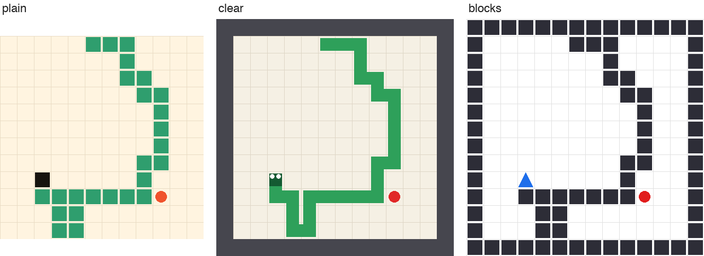

# Snake from a Picture

> Test 4 of this repo. Key code and every number in detail: [docs/7-vision-snake.md](7-vision-snake.md).
> Model: Cloudflare's Clef-flash (9B), zero-shot as released, on one laptop. Runs of 9 October 2026.

In the text Snake test ([snake-report.md](snake-report.md)) every model gets the board as text. Here Clef-flash, the
only model in this repo that takes images, gets **a picture of the board** instead, and nothing else: no positions,
no directions, no facts computed by code. We asked two things: **can it see the board, and can it play from it?**

**In short:** it sees the board well enough to steer towards the food, but code has to keep it out of moves that
kill it. Then it plays better than a simple greedy program; alone, it crashes within a few moves.



*The same position drawn three ways. **blocks** (right) worked best: walls and body are the same dark squares, the
head is an arrow.*

## What we found

1. **It sees where the food is.** Above or below, left or right of the head: right 94–98% of the time, in every
   drawing style.
2. **How the board is drawn matters a lot.** Whether the cell next to the head is blocked: 57% right with a joined
   green body, 81% with every obstacle drawn as the same dark square. Which way the snake is moving: chance with a
   plain head, 53% with an arrow.
3. **Alone, it can't play.** Given the picture and four directions, it crashes in every game (1.1 food per game).
   Mostly it picks "go back the way you came" next to a wall; the game ignores that, and the snake drives on into
   the wall.
4. **With the deadly moves removed by code, it plays well**: 25.2 food per game, more than a simple "go towards the
   food" program (21.0). 94% of its moves get closer to the food. It still gets trapped in 9 of 10 games, because it
   can't see dead ends coming.
5. **Asking yes/no questions per direction fails.** "Is this cell free? Does it get closer to the food?" for each
   direction, with code picking the move: 1.2 food per game. Asked separately, its "closer?" answers are coin flips;
   asked as one choice between moves, the same judgement is right 94% of the time.
6. **Showing the previous frame makes it worse.** It helps the model tell which way the snake is moving (53% → 70%),
   but then it goes straight too often, and every way of asking picks worse moves.
7. **Text with code-written hints still plays best.** When code writes "moves closer to the food; keeps the most
   room" or "DEAD END" into each option, Clef-flash eats 39.3 food per game without dying, but then a table of seven
   phrases with no model at all does about as well (39.0).

## What we tried

**Step 1, seeing:** 150 board positions, seven questions each whose answer code knows: is the food above / to the
right of the head, which way is the head moving, and is each of the four cells next to the head free. Asked from
four drawing styles, from two frames, and from the text board.

**Step 2, playing:** three ways of asking for a move, each first on single positions with a known good answer, then
in 10 games (12×12 board, the same seeds and rules as the text test):

| Request | The model gets | Code does |
|---|---|---|
| **see-4** | the picture and all four directions | nothing |
| **see-legal** | the picture and only the moves that don't end the game now | removes deadly moves |
| **see-ask** | two yes/no questions per direction: free? closer to the food? | picks the free direction most likely to get closer |

## Step 1: can it see the board?

Balanced accuracy (0.50 is guessing; heading has four answers, so 0.25 is guessing):

| Question | plain | clear | **blocks** | blocks, 2 frames | text board |
|---|--:|--:|--:|--:|--:|
| Food above the head? | 0.97 | 0.97 | **0.98** | 0.95 | 0.98 |
| Food right of the head? | 0.94 | 0.95 | **0.96** | 0.96 | 0.78 |
| Which way is it moving? | 0.26 | 0.37 | 0.53 | **0.70** | 0.21 |
| Blocked cell next to the head seen as blocked | 0.70 | 0.57 | **0.81** | 0.81 | 0.57 |

* **plain** is the look of the only earlier experiment we found (hatch, Qwen3-VL): green squares, a black head.
  **clear** joins the body into one chain and gives the head eyes. **blocks** draws walls and body as the same dark
  squares and the head as an arrow.
* Removing the wall ring from blocks changed nothing. Asking the seven questions one at a time instead of all
  together helped heading a little and hurt blocked cells.
* The picture reads left/right better than the text board (0.96 vs 0.78): in text, left/right means counting
  characters along a row.

## Step 2: can it play?

Single positions (150 positions / 100 "hard" ones where going straight is allowed but wrong), share of good moves:

| Request | One frame | Two frames |
|---|--:|--:|
| see-4 | 0.83 / 0.74 | 0.83 / 0.66 |
| **see-legal** | **0.98 / 0.98** | 0.92 / 0.78 |
| see-ask | 0.82 / 0.73 | 0.81 / 0.59 |

Games (one frame, blocks style, 10 games each):

| Player | Food per game (mean / best) | Died |
|---|--:|--:|
| **Clef-flash, see-legal** | **25.2** / 39 | 9 of 10, trapped |
| Clef-flash, see-ask | 1.2 / 2 | 6 crashed, 4 starved |
| Clef-flash, see-4 | 1.1 / 5 | 10 of 10 |
| *Clef-flash, text board* | *6.5 / 15* | *10 of 10* |
| *Clef-flash, text with code-written hints* | *39.3 / 45* | *0 of 10* |
| *Code: go towards the food, never a deadly move* | *21.0 / 32* | *10 of 10* |
| *Code: the same, plus a dead-end check* | *41.1 / 44* | *2 of 10* |
| *Qwen3-VL-4B / 8B from screenshots (hatch, 23 games)* | *1.1 / 0.0* | *23 of 23* |

* see-4 matches the earlier screenshot experiment almost exactly: 1.1 food and a median of 8 moves, against hatch's
  1.1 and 9.
* see-legal moves at about 1.1 s per move on the laptop; see-ask takes 2.6 s (eight questions per request).
* Single positions overstate see-4 and see-ask: the deadly picks are rare in the probe but happen sooner or later in
  a game, and one is enough.

## Picture against text

* **For seeing the board, the picture is better.** Same questions, same positions: left/right of the food 0.96
  against 0.78, and on the text board two of the four "is this cell free?" questions are at chance.
* **For playing, the comparison isn't finished.** From the picture with deadly moves removed: 25.2 food; from the
  text board without that help: 6.5. Part of that gap is the help, not the picture. On single positions without
  help, the text board is slightly ahead (0.87 / 0.85 against 0.83 / 0.74), and that text request also gives the
  head and food coordinates. The missing run is the text board with only the safe moves offered.
* **The same weaknesses show up in both.** It judges best when it compares the options in one question, and anything
  that shows the current direction (the words "heading: up" in text, the motion in a second frame) pulls it towards
  going straight.
* **Code-written hints beat both**, and once they're there the model is hardly needed: a table of phrases plays as
  well. The picture can replace the board-reading part of the text prompt, not the lookahead that code computes.

## Limits

* One model, one board size (12×12), 10 games per request, one run. Clef-flash's answers are deterministic (seeds
  replayed after a restart gave identical games), so a rerun gives the same numbers.
* Zero-shot only: a model trained on such pictures could do far better.
* The probe's "previous frame" for single positions is rebuilt from the position (games use the real one).
* The 27B Clef doesn't fit this 32 GB laptop and wasn't tried.

## Reproduce

```bash
third_party/clef-env/.venv/bin/python adapters/clef_server.py --port 8720
uv run python 14_vision_snake_probe.py --style blocks          # seeing (also --style plain|clear, --frames 2, --modality text)
uv run python 15_vision_snake.py probe --style blocks          # single moves, all three requests
uv run python 15_vision_snake.py games --style blocks          # 10 games each
uv run python 15_vision_snake.py summary
```

Any model behind a `/v1/systemone` server that reads `images` can be tested the same way with `--engine`.
